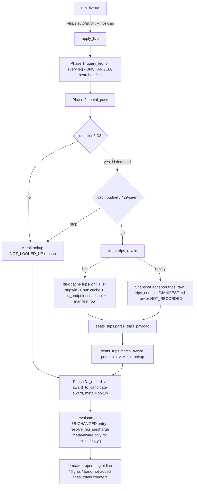

# Plan: operating-airline lookup through the Seats.aero trips endpoint

Branch `feature/operating-airline`, off `master` at `a17497d`. Input: the
2026-09-11 handoff (feature 1). Baseline on this branch before any change:
**937 passed, 13 skipped**; probe suites 19 red / 79 green (v5), 40 red / 38
green (adversarial), 140 green (known-failures). Compare red SETS by test id.

## 1. Summary

For each live award whose cash side depends on which airline flies it, call
`GET /partnerapi/trips/{availability_id}` once, match the returned itineraries
to the award, and report the flight numbers and the carrier they name, with
their provenance. Under today's rules this changes disclosure and unpriced
alternatives only. It cannot change a score, a verdict or an exit code until
Tsuki settles, per source, whether Seats.aero's `TotalTaxes` already includes
carrier surcharges (YQ).
Every way the lookup can fail shows up as a named NOT KNOWN / NOT LOOKED UP /
NOT RECORDED line. None of them is ever turned into "no trips" or a carrier.

## What reading the code changed about the handoff

1. **The YQ check as written can't be run.** British Airways Club is not a
   Seats.aero source in `SEATS_AERO_SOURCES` (BA/IB/EI are left out on purpose),
   and Virgin Atlantic cannot ticket BA metal (`bookable_carriers` for VS is
   `VS, DL, AF, KL`). The check that settles something is a **`virginatlantic`
   award on VS metal** (surcharge row `VS/VS/NA-EU/J`, $400-700 RT, which is large
   enough to tell apart from taxes). Its answer applies to that one source.
2. **"Iberia Plus on IB metal" cannot come from live data this round.** No
   Seats.aero source is both a direct UR partner and able to ticket IB. Live IB
   awards come from `american`, `alaska`, `qatar` and `finnair`, and none of
   those reaches `best_points`, which is the only place `find_same_metal_alternatives`
   runs. I checked it: an AAdvantage candidate on IB would produce Iberia
   Plus ($75-100) and BA ($522-1,045) alternatives, but only if it could win the
   leg, and it cannot. Pointing from a non-UR award to a UR program is a verdict
   change and gets its own round (see Decisions for Tsuki, T2).
3. **The daily budget is per process.** `SeatsClient._calls_made` is a class
   counter that resets with each run. It cannot see yesterday's runs or another
   terminal. Seats.aero's real limit shows up as HTTP 429, and 429 has to map to
   its own state.
4. **`carrier_source` does two jobs.** It means "the metal is known", and it
   also means "the taxes may be combined with a modelled surcharge"
   (`seats_aero_live_taxes_unresolved` exists so a single-carrier award does not
   score). Metal from trips needs its own field so it can drive disclosure and
   alternatives without also unlocking scoring.
5. **`tests/fixtures/trips/` already means trip fixtures.** Everything for this
   endpoint is named `trips_endpoint` / `seats_trips` so the two can't be
   confused.
6. **Snapshot-corpus globs would choke on trips envelopes.** `snapshots()`,
   `_snapshot_with_content` and several tests glob `snapshot_dir/*.json` and
   `cache_dir/*.json`. The search parser would read a trips payload's `data`
   list as unreadable availability rows. So trips bytes go in subdirectories.

## 2. Assumptions & decisions

Numbered so the Coder, Tester and Manager can refer to them.

**When the tool calls /trips (Q1)**
- D1. **Modes.** Trip mode, live (`--trip-fixture`): yes. Trip mode, replay
  (`--from-snapshot`): reads recorded trips snapshots only, never the network.
  `--offline`: never (there are no live candidates). Single-route search
  (`--origin/--destination`): never this round. It prints one footer line:
  "operating airline: NOT LOOKED UP - single-route search does not call the
  trips endpoint; use --trip-fixture or `python -m src.trips_tools capture`".
- D2. **Which awards qualify (`--trips auto`, the CLI default).** A live
  candidate (on-date or promoted; off-date findings are never looked up) with a
  valid `availability_id`, whose program is a **direct** UR partner
  (`ur_transferable is True`), and whose carrier surcharge is **not**
  metal-independent. The test for that last part is the one
  `_taxes_are_the_whole_carrier_cash_figure` already uses: `surcharges.resolve(program,
  "", ..., carrier_is_known=False)` is not a known $0. Today that picks out
  Virgin Atlantic, Flying Blue, JetBlue and KrisFlyer. It leaves out United and
  Aeroplan, which get NOT_LOOKED_UP/`NOT_NEEDED_POLICY` with the sentence "{program}
  levies no carrier surcharge whatever the metal, so the metal cannot change this
  answer". `--trips all` looks up every live candidate with an id (disclosure
  only, still capped). `--trips off` looks up nothing.
- D3. **One call per availability id.** One row carries four cabins, and the
  trips response carries itineraries for all of them. So the lookups are
  deduplicated by id, and every cabin of that row is matched from the one
  response.
- D4. **Order and cap.** Lookups run in a second phase of `apply_live`, **after
  every leg's search has finished**, so trips can never take budget a search
  needed. Order is fixture leg order, then candidate order. The per-run cap
  `--trips-cap N` defaults to **10** and must be between 1 and 50. It counts HTTP
  requests actually sent; disk-cache hits are free.
- D5. **One budget counter.** `trips_raw` calls the same `SeatsClient._budget_remaining()` /
  `_count_call()` as search, counts before it sends (the search pattern), and
  sends nothing when the counter is at 0. The live banner prints the calls spent,
  split into search and trips.
- D6. **The cap, the budget, 429 and `--trips off` are not findings.**
  - Cap reached: `NOT LOOKED UP - the per-run cap of 10 lookups was reached`.
  - Counter at 0: `NOT LOOKED UP - the Seats.aero call budget for this run is spent; no request was made`.
  - After the first HTTP 429: that lookup is `NOT KNOWN (HTTP 429 ...)`, and every
    later one is `NOT LOOKED UP (Seats.aero rate-limited an earlier lookup in this run)`.
  - `--trips off`: `NOT LOOKED UP (--trips off)`.

  Each of these lines ends with "Nothing is known about which airline flies it;
  the possible carriers are {row list}". None of them uses the words "unknown for
  a data reason", "no trips" or a bare carrier code.

**Cache / snapshot / replay (Q2)**
- D7. **Request.** The request is always
  `?include_filtered=false&min_cabin_pct=100`, sent explicitly even though these
  are the documented defaults, so the cache key and snapshot record exactly
  what was asked. `request_key("trips", {"availability_id", "include_filtered", "min_cabin_pct"})`.
  - `include_filtered=false`: the award being matched is a non-Raw price, and
    dynamically priced trips are a different product.
  - `min_cabin_pct=100`: a mixed-cabin itinerary is a different product from a
    {cabin} award.
- D8. **Storage layout.**
  - Cache entries go in `cache_dir/trips/`.
  - Snapshots go in `snapshot_dir/trips_endpoint/<leg>_trips_<id>_<stamp>.json`.
  - There is a separate `snapshot_dir/trips_endpoint/MANIFEST.md` with the
    **same column layout** as the search manifest. The route column holds
    `trips:<availability_id>`, the dates column holds the award date, and the
    awards column holds the number of itineraries parsed. That lets
    `parse_manifest`, `select_replay_set` and `verify` (all the tamper, missing
    and zero-page checks) be reused unchanged.

  The search manifest and its hash are untouched when no trips rows exist.
- D9. **Envelope.** It is the same format as search: `endpoint: "trips"`,
  `parser_version: TRIPS_PARSER_VERSION`, `key_redacted: true`, and the derived
  provenance keys. `put` honours a `parser_version` passed in `meta`.

  I'm giving trips its own version, `TRIPS_PARSER_VERSION =
  "2026-09-11.trips-unverified"`. The alternative was bumping `PARSER_VERSION`,
  and I rejected it: that would make every existing search snapshot replay as
  REPARSED even though its parse did not change.
- D10. **What is not cached.**
  - Budget refusals, HTTP errors (404 included), timeouts, transport errors and
    JSON decode errors are never cached or archived. That follows the search
    precedent (H-1 and `raise_for_status`).
  - A 2xx whose JSON has the wrong shape **is** cached and archived as
    `pages=[payload]`, with no `or {}` coercion. It then parses to the same
    named UNKNOWN on every read.
- D11. **Replay.**
  - `SnapshotTransport.trips_raw` reads only `trips_endpoint/MANIFEST.md` rows,
    keyed by availability id. It never calls the network and needs no key.
  - An id with no row gives `NOT RECORDED - this replay has no trips snapshot
    for availability {id}; nothing was asked of Seats.aero on this run`.
  - A recorded row is used whatever the qualification, because it is evidence
    the live run had.
  - A selected trips row whose file is missing, tampered with or has zero pages
    **refuses the whole replay** (exit 1, the no-partial-replay rule). The
    refusal says to re-fetch or to delete the row. Deleting the row turns those
    lookups into NOT RECORDED.
  - `manifest_hash` appends `trips|leg|route|dates|snapshot|recomputed_hash`
    lines **only when trips rows exist**, so trips-less manifests keep their
    hash byte for byte. This is pinned in Step 0.
  - A trips row's `parser_version` that is not `TRIPS_PARSER_VERSION` prints a
    `TRIPS LOOKUPS REPARSED` banner line and a per-line replay clause.

**Parsing (Q3)**
- D12. **Strict on required fields, tolerant of extras.**
  - Envelope: an object with a `data` list.
  - Trip, required: `ID`, `AvailabilityID` (must equal the requested id),
    `Source`, `Cabin`, `MileageCost` (an int; a digit string is accepted and
    recorded as drift; bool, float and None are refused), and
    `AvailabilitySegments` (a non-empty list).
  - Segment, required: `FlightNumber`, `OriginAirport`, `DestinationAirport`,
    `Order` (distinct ints).
  - Used if present, and checked if present: `FlightNumbers` (must equal the
    segment flight numbers in `Order`), `Carriers` (must equal the set of
    flight-number prefixes; a disagreement may mean one of them is the operating
    carrier, so the trip is **unreadable**, not guessed), `MixedCabinPct`
    (1-100), `TotalTaxes`, `TaxesCurrency`, and the times and aircraft fields.
  - Route chain: each segment starts where the one before it ended, and the
    itinerary starts and ends at the award's route. Otherwise the trip is
    unreadable.
  - Unknown keys at any level are listed as drift and are never an error.
  - `hasMore` true, a `cursor`, or an advancing `skip` makes the list incomplete.
- D13. **Every failure is a named UNKNOWN, never "no trips" and never a carrier.**
  The reason codes (the prose is in `MetalLookup.render()`, and nowhere else):

  | condition | status / reason |
  |---|---|
  | HTTP 404 (empty body) | UNKNOWN `HTTP_404`: "Seats.aero has no itinerary record for availability {id}. This does NOT mean the award has no flights (the row may have been refreshed since the search)." |
  | HTTP 429 | UNKNOWN `HTTP_429`, and later lookups are NOT_LOOKED_UP (D6) |
  | other non-2xx | UNKNOWN `HTTP_ERROR` (status named) |
  | timeout / connection | UNKNOWN `TIMEOUT` / `TRANSPORT_ERROR` |
  | body is not JSON | UNKNOWN `JSON_ERROR` |
  | not an object; `data` missing or not a list | UNKNOWN `SHAPE_ERROR` |
  | `data: []` | UNKNOWN `EMPTY_DATA`: "an empty itinerary list is NOT a finding that the award has no flights" |
  | pagination says there is more | UNKNOWN `INCOMPLETE` |
  | a trip that could match (source, cabin and cost not all readable and non-matching) is unreadable | UNKNOWN `TRIP_UNREADABLE` / `CABIN_UNMAPPED` / `FLIGHT_NUMBER_UNPARSEABLE` / `TRIP_INCONSISTENT` / `AVAILABILITY_ID_MISMATCH` |
  | no readable trip matches | UNKNOWN `NO_MATCH` (names the costs seen for that cabin) |
  | only mixed-cabin trips match | UNKNOWN `MIXED_CABIN_ONLY` |
  | a segment carrier is not in the row's `{X}Airlines` | UNKNOWN `CARRIER_NOT_IN_ROW_LIST` |
  | the row's `{X}Airlines` is empty | UNKNOWN `ROW_CARRIERS_ABSENT` |
  | anything unexpected inside the lookup | UNKNOWN `UNEXPECTED_ERROR` (the metal pass never raises, as with `query_leg`) |
- D14. **The parser is labelled UNVERIFIED until a real capture is committed.**
  - `seats_trips.TRIPS_SCHEMA_VERIFIED_BY: str = ""`.
  - While it is empty, every KNOWN, AMBIGUOUS and parse-derived UNKNOWN line
    ends with "[trips parser UNVERIFIED against a real Seats.aero response - built
    from the published schema only]", and the live banner says the same.
  - **The flip:** a real capture written by `src.trips_tools capture` is
    committed under `tests/fixtures/seats_aero/trips_endpoint/real/`, and the
    constant is set to its filename.
  - `tests/test_trips_verification_label.py` pins both branches:
    - Constant empty: the label is present in the renders and the banner.
    - Constant set: the file exists under `real/`, has `_meta.synthetic is
      False`, `captured_by == "src.trips_tools capture"`, `key_redacted`, a
      matching content hash and a `.raw.txt` sibling, and parses to at least one
      trip with zero unreadable trips and no required-field drift. The constant
      can never name a file under `synthetic/`.
  - Every file in `real/` must parse without required-field drift, so a drifting
    capture forces a parser fix before anyone can flip the label.

**Matching (Q4)**
- D15. **Cabin vocabulary.** The code's vocabulary is the letters Y/W/J/F
  (`seats_client.CABINS`, `Award.award_type`, `PointsCandidate.cabin`, the
  `surcharges.csv` cabin column). No word-to-letter mapping exists anywhere yet;
  `trip_builder.CABINS` is display text, with W as "premium economy". The mapping
  is exact on a lowercased, stripped value:
  `{"economy":"Y", "premium":"W", "business":"J", "first":"F"}`.
  - "business" comes from the OpenAPI example. The other three are assumed:
    this is the vocabulary of Seats.aero's own cabin parameter, and it is
    UNVERIFIED.
  - Any other value is `CABIN_UNMAPPED`. The capture's drift report lists every
    cabin value seen.
- D16. **Match rule.**
  - A trip matches when `Source` (case-insensitive) equals the award's
    `program_source_code`, the mapped `Cabin` equals `award_type`, and
    `MileageCost == award.cost`.
  - A trip with `MixedCabinPct > 0` is taken out of the match set. It is
    disclosed ("k further itineraries at this price fly part of the distance in
    a lower cabin; not counted"). Under `min_cabin_pct=100` its presence is also
    drift.
  - If the matched trips share one carrier set, the result is KNOWN. If there is
    more than one set, it is AMBIGUOUS, and every set is listed.
  - Trips at other prices in the same cabin are disclosed only, as "other
    itineraries in J at 70,000 (2) - not this award's price".

**Marketing vs operating (Q5)**
- D17. **The claim.** A KNOWN result is rendered "**{carrier} by flight number**
  ({flights})". It is always followed by "Seats.aero reports the MARKETING
  carrier; it does not report who operates the flight". When the row lists more
  than one carrier, it adds "A codeshare operated by another airline in this
  award's list ({list}) cannot be detected". The words "operated by X" are never
  printed as a finding. Provenance: `carrier_source = "seats_aero_trips"`.
- D18. **The cross-check.** Every segment carrier must be in the row's
  `{X}Airlines` for the award's cabin (`parse_carriers`). If one isn't, the
  result is UNKNOWN, not "the other one", because two Seats.aero fields
  disagree. A codeshare between two carriers that are **both** in the list is
  undetectable. For that case the tool claims only the marketing carrier, and
  the line says so.
- D19. **Parsing the flight number.** Upper-case, strip, and drop whitespace
  between the prefix and the digits, then match:
  - `^([A-Z][A-Z0-9]|[0-9][A-Z])([0-9]{1,4})([A-Z]?)$` is an IATA 2-character
    code with at least one letter, so `9W123`, `B6 1`, `ua194`, `U21234`,
    `A3601` and `BA0117` all parse.
  - `^[A-Z]{3}[0-9]{1,4}[A-Z]?$` is a 3-letter ICAO designator. It is
    `FLIGHT_NUMBER_UNPARSEABLE` with the note "ICAO designator; no ICAO->IATA
    table is configured, not guessed".
  - Everything else, including all-digit prefixes, empty values, None and
    non-strings, is unparseable.
  - Membership in `carriers.csv` is not required. The row list is the authority.
- D20. **When marketing metal may key a scored surcharge.** Only when the
  award's source has a verified `excludes_yq` row (D23), which only Tsuki can
  add. The reasoning: partner award space is normally filed under the operating
  carrier's own flight number, and the row-list check catches cross-list
  codeshares. The in-list residual is disclosed on the line. Until that row
  exists, trips metal never enters a score.

**What known metal changes (Q6)**
- D21. **The change table.** "unverified" is the committed default for every
  source.

  | line / field | YQ unverified (default) | source `includes_yq` | source `excludes_yq` |
  |---|---|---|---|
  | "operating airline:" + "flights:" lines (per-leg detail, live block) | new | new | new |
  | `CARRIER_UNKNOWN` reason | dropped when KNOWN (it would contradict the metal line) | dropped when KNOWN | dropped when KNOWN |
  | surcharge note | names the modelled band for the known metal and says it is **NOT ADDED** because inclusion is unverified | not shown: the taxes are the whole carrier figure | the band becomes the scored surcharge (`SURCHARGE_MODELED`) |
  | same-metal alternatives (`find_same_metal_alternatives`) | may appear (unpriced, `ALTERNATIVE_UNPRICED`, leg-only). Example: a VS award on AF metal gets Flying Blue $75-125 | may appear | may appear |
  | scoreable / verdict / score / floor / break-even / trip range / margin / withholding / exit code | **unchanged: a lookup cannot move them** | set by the YQ row, **not** by metal (metal is irrelevant) | set by metal: KNOWN or AMBIGUOUS that resolves gives taxes + modelled band (a range); anything else stays unscoreable with `SURCHARGE_UNKNOWN` |
  | trip totals | two new counters (D25) | same | same |

  Multi-carrier: the surcharge uses `resolve_ambiguous_metal(program,
  carriers)`. For KNOWN that is the itinerary's set; for AMBIGUOUS it is the
  union of all matched sets. It resolves only when every carrier gives the same
  outcome.

  `cross_metal_note` is unchanged: it only fires for $0-policy candidates, which
  are never looked up in auto.
- D22. **The scoreability rule.** It lives in `_taxes_are_the_whole_carrier_cash_figure`,
  extended with keyword arguments; the name is kept because tests import it. It
  applies only when the row taxes are **trusted**: known, convertible, not from
  an unreported source, not 0, not negative and not below APD. Untrusted taxes
  are unscoreable in every case, exactly as today.
  - A. Program-policy $0 (tier 5): scoreable, and the taxes are the whole
    carrier figure. This is today's behaviour.
  - B. Source `includes_yq`: scoreable. The taxes ride as the captured surcharge
    (`observed_taxes_are_the_surcharge=True`), **no band is added**, and the
    formatter names the evidence file instead of "program policy".
  - C. Source `excludes_yq` and trips metal KNOWN or AMBIGUOUS: `carrier_source="seats_aero_trips"`.
    The cash side is the taxes (`extra_observed_taxes_usd`) plus the modelled
    band. Scoreable only if the band resolves.
  - D. Source `excludes_yq` without that: unscoreable, and the surcharge note
    names the metal status.
  - E. Unverified: A or unscoreable. This is exactly today's rule.

  Double counting is impossible by construction: B never adds a band, and C
  adds a band to a figure verified to exclude it. The undercount guard is that
  no source leaves E without a row backed by evidence.
- D23. **The YQ setting.** `data/yq_inclusion.csv`, with columns
  `source,verdict,verified_on,evidence,notes`. It is committed with the header
  only. An absent row means unverified; a row can never say "unverified". It is
  loaded by `src/yq_inclusion.py`, which validates at load and **raises** on:
  - a source not in `SEATS_AERO_SOURCES`;
  - a source in `TAXES_UNREPORTED_SOURCES`;
  - a verdict other than `includes_yq` / `excludes_yq`;
  - a future `verified_on`;
  - a duplicate source;
  - an evidence path that is missing, outside `docs/yq-checks/`, lacks the
    `yq-check record` marker, or still has `____` blanks.

**Per-trip figures (Q7)**
- D24. **Which figure is scored.**
  - The **row's** `{X}MileageCost` and `{X}TotalTaxes` are scored, as today.
    Matching requires `MileageCost` equality, so there is no second price.
  - The unit of the per-trip `TotalTaxes` is `seats_trips.TRIPS_TOTALTAXES_UNIT
    = "unverified"` (the allowed values are `cents` and `units`). While
    unverified, per-trip taxes are **display only**: "raw 4460 CAD (unit NOT
    VERIFIED: CAD 44.60 if cents, CAD 4,460 if whole units); not used in any
    figure".
  - The flip to `cents` needs a real capture whose `_meta.availability_row`
    shows a matched trip with `TotalTaxes == {X}TotalTaxes`. The label test pins
    this the same way as D14.
  - Once flipped, each matched trip's figure goes through the **same** trust
    rules: an unreported source is never read; 0 means not reported; a negative
    is corrupt; an unconvertible currency is unknown; below APD is incomplete
    (`taxes_below_owed_uk_duty` with that figure).
  - If any matched trip's figure is UNKNOWN, or is above the row's figure by
    more than max($1, 1%), the award's taxes become **UNKNOWN**
    ("which itinerary you book decides the figure; between $row and $max"), and
    `TAXES_UNKNOWN` widens as today. Lower figures are only disclosed.

**Way ten / way eleven (Q8)**
- D25. **Two new reason codes.** Both names contain a way-ten marker, so they are
  discovered automatically.
  - `METAL_LOOKUP_MISSING`: NOT_LOOKED_UP (cap, budget, `--trips off`, no or
    invalid id, rate-limited) or NOT_RECORDED. COUNTED_AT_TRIP_LEVEL, key
    `legs_metal_lookup_missing`.
  - `METAL_UNKNOWN`: UNKNOWN or AMBIGUOUS. COUNTED_AT_TRIP_LEVEL, key
    `legs_metal_unknown`.
  - They are emitted by `evaluate_leg` for `result.best_points` only, with
    literal `add_reason("...")` calls. They are not emitted for
    `NOT_NEEDED_POLICY` or `NOT_DIRECT_PARTNER`, where metal cannot change the
    answer.
  - Why they are counted rather than made to widen the range: neither is itself
    an unknown dollar. Wherever metal changes a dollar (D22 C/D), it does so by
    leaving the surcharge unresolved, which is `SURCHARGE_UNKNOWN`. That already
    widens the range and is already counted. Counting keeps "not looked up" in
    the trip block, so it can't read as "known".
- D26. **Way eleven, partly closed for the new codes.** Every non-KNOWN
  `MetalLookup` must carry its **domain**. That is `possible_carriers` (the row's
  `{X}Airlines` for the cabin, or the union of the sets for AMBIGUOUS), or else
  `domain_unbounded=True` with a reason (the row list is empty). This is
  enforced in `__post_init__`, and the domain is printed on every such line. The
  **dollar** range of the new unknowns (the surcharge spread across the possible
  carriers) is deferred to the general way-eleven work.

**Tools (Q9) and docs (Q10)**
- D27. **`python -m src.trips_tools` is a separate module**, not a `main.py`
  subcommand, so the 0-4 exit-code contract tested against `main.py` is
  untouched. It has two subcommands, `capture` and `yq-check` (§4.8). Its exit
  codes: 0 captured and clean; 1 nothing captured (usage, no key, declined,
  HTTP or network error, key material detected); 5 captured with drift (the
  file is written; do not flip the label).
- D28. **No new verdict string and no new `main.py` exit code.** The README
  gains a section, rows for the flags and statuses, and a separate
  `### trips_tools exit codes` table (§6, Step 13).
- D29. **Existing tests stay unedited.** `LiveOptions.trips_mode` defaults to
  `None`, which means "not engaged" and gives byte-identical legacy output for
  the existing direct `apply_live` callers and their stub clients (which have no
  `trips_raw`). The CLI always passes a mode. A client without `trips_raw`
  under an engaged mode gives NOT_LOOKED_UP (`TRANSPORT_HAS_NO_TRIPS`).

## 3. Out of scope

- Pointing from a non-UR award to a UR program on the same metal (for example
  AAdvantage space on IB metal pointing to Iberia Plus). Decision for Tsuki T2.
- Lookups in single-route search mode. The search ranking's existing blindness
  to YQ is unchanged.
- Scoring per-trip taxes beyond the D24 "raise to UNKNOWN" rule. Choosing among
  itineraries. Booking links.
- Inferring the operating carrier from `AircraftName` or `AircraftCode`, or any
  other source. ICAO-to-IATA tables.
- A persistent cross-run call budget.
- The dollar ranges for way eleven. The UI. Hotels. Party pricing.
- `include_filtered=true` / `min_cabin_pct<100` requests.
- New surcharge rows. The Iberia/BA rows stay as they are.

## 4. Architecture

### 4.1 Flow



`apply_live` is restructured into these three phases. Phase 1 is the existing
loop without the inline `_record`. `_record` reads nothing that `query_leg` does
not, so moving it after the loop does not change behaviour, and the unchanged
suite proves that.

### 4.2 Data model

`src/models.py`:
```python
class MetalStatus(str, Enum):
    KNOWN = "known"; AMBIGUOUS = "ambiguous"; UNKNOWN = "unknown"
    NOT_LOOKED_UP = "not_looked_up"; NOT_RECORDED = "not_recorded"

METAL_REASONS = {  # the only legal reason codes per status (render() prose keyed on these)
  UNKNOWN: {HTTP_404, HTTP_429, HTTP_ERROR, TIMEOUT, TRANSPORT_ERROR, JSON_ERROR, SHAPE_ERROR,
            EMPTY_DATA, INCOMPLETE, TRIP_UNREADABLE, CABIN_UNMAPPED, FLIGHT_NUMBER_UNPARSEABLE,
            TRIP_INCONSISTENT, AVAILABILITY_ID_MISMATCH, NO_MATCH, MIXED_CABIN_ONLY,
            CARRIER_NOT_IN_ROW_LIST, ROW_CARRIERS_ABSENT, UNEXPECTED_ERROR},
  NOT_LOOKED_UP: {TRIPS_OFF, CAP_REACHED, BUDGET_EXHAUSTED, RATE_LIMITED_EARLIER, NOT_NEEDED_POLICY,
                  NOT_DIRECT_PARTNER, NO_AVAILABILITY_ID, AVAILABILITY_ID_INVALID, TRANSPORT_HAS_NO_TRIPS},
  NOT_RECORDED: {NO_TRIPS_SNAPSHOT},
}

@dataclass(frozen=True)
class MetalLookup:
    status: MetalStatus
    availability_id: str = ""
    reason_code: str = ""; detail: str = ""
    carriers: Tuple[str, ...] = ()                    # KNOWN only, flight order
    carrier_sets: Tuple[Tuple[str, ...], ...] = ()     # AMBIGUOUS only, >= 2 distinct
    possible_carriers: Tuple[str, ...] = ()            # domain for every non-KNOWN (D26)
    domain_unbounded: bool = False
    row_carriers: Tuple[str, ...] = ()                 # for the codeshare clause
    flights: Tuple[str, ...] = ()                      # "VS19 SFO 2027-01-15T16:30 -> LHR ... (787-9)"
    matched_trips: int = 0; excluded_mixed: int = 0; other_price_note: str = ""
    trip_taxes_note: str = ""                          # display only (D24)
    provenance: str = ""                               # set for KNOWN/AMBIGUOUS
    parser_verified: bool = False
    served_from_cache: bool = False; fetched_at: Optional[datetime] = None
    on_replay: bool = False; replayed_from_snapshot: bool = False
    snapshot_name: str = ""; snapshot_content_hash: str = ""; snapshot_parser_version: str = ""
```
The `__post_init__` checks raise ValueError, so they survive `-O`:
- KNOWN needs carriers, `matched_trips >= 1`, an empty reason and a provenance.
- AMBIGUOUS needs at least 2 distinct `carrier_sets`, empty `carriers` and
  `matched_trips >= 2`.
- Every other status needs a reason in `METAL_REASONS[status]`, a non-empty
  detail, empty `carriers` and `carrier_sets`, and exactly one of
  `possible_carriers` or `domain_unbounded`.
- NOT_LOOKED_UP can have no fetched bytes: not served from cache, no
  `fetched_at`, not replayed. NOT_RECORDED needs `on_replay`.
- `replayed_from_snapshot` needs a snapshot hash and must not also be
  `served_from_cache`. `served_from_cache` needs `fetched_at`.

`render()` is `_status_sentence() + _domain_clause() + _codeshare_clause() +
_parser_clause() + _replay_clause()`, and the clauses are appended
unconditionally, the `LiveLegOutcome` pattern.

**Storage classification.** `MetalLookup` itself is never persisted; only the
raw trips bytes are. A classification like way (9) is checked at import through
`_fields_read_by_invariants(MetalLookup)`:
- recomputed from the bytes: status, carriers, carrier_sets, matched_trips,
  possible_carriers, domain_unbounded, reason_code, detail;
- local to the run: served_from_cache, on_replay, replayed_from_snapshot,
  snapshot_content_hash, provenance;
- carried by the transport: fetched_at, which `put` already persists.

New `PointsCandidate` fields: `metal: Optional[MetalLookup] = None`,
`availability_id: str = ""`, `program_source_code: str = ""`,
`row_carriers: List[str] = []` and `observed_taxes_whole_because: str = ""`
(`"program_policy"` or `"yq_included_verified:<evidence>"`).
`has_known_metal` also accepts `carrier_source == "seats_aero_trips"`, but only
for a single carrier. A new property, `metal_for_alternatives`, returns the
known single carrier, from `has_known_metal` or from a KNOWN single-carrier
`metal`, and "" otherwise.

`REASON_CODES` gains `METAL_LOOKUP_MISSING` and `METAL_UNKNOWN`, and
`TRIP_LEVEL_ANSWERS` gains their rows (D25).

`src/seats_trips.py` (new) holds the constants `TRIPS_PARSER_VERSION`,
`TRIPS_SCHEMA_VERIFIED_BY`, `TRIPS_TOTALTAXES_UNIT`, `TRIPS_REQUEST_PARAMS`,
`CABIN_FROM_TRIPS`, `AVAILABILITY_ID_RE = r"^[A-Za-z0-9]{10,64}$"` and
`DOCUMENTED_TOP/TRIP/SEGMENT_KEYS`. Its types:
- `TripSegment`: order, flight_number, carrier, origin, destination,
  departs_at, arrives_at, aircraft;
- `TripItinerary`: id, source, cabin (a letter or None), mileage_cost,
  total_taxes_raw, taxes_currency, mixed_cabin_pct, segments, carriers (a
  tuple), and unreadable_reason plus a partial key for unreadable trips;
- `ParsedTrips`: trips, envelope_error (a code and a sentence), incomplete,
  drift (a list of str) and cabins_seen.

Its functions are `parse_flight_number()`, `parse_trips_payload(payload,
requested_id, route)`, `match_award(parsed, award_facts) -> MetalLookup`,
`trip_taxes_view()` and `trips_parser_label()`.

`src/seats_client.py`: `RawTripsResult` has `payload`, `http_status`,
`served_from_cache`, `fetched_at`, `request`, `request_key`, `snapshot_name`,
`manifest_key`, `incomplete` and `incomplete_reason`.
`assert_transport_carries(RawTripsResult)` runs at import.
`TripsLookupError(SeatsAeroError)` carries a `.code` from D13.

### 4.3 API contract

```
GET https://seats.aero/partnerapi/trips/{availability_id}?include_filtered=false&min_cabin_pct=100
Partner-Authorization: <key>      Accept: application/json      timeout=15s
2xx -> JSON (parsed per D12)   404 -> empty body   429/5xx -> error   (none cached)
```
The id is validated against `AVAILABILITY_ID_RE` before any URL is built. A
failure is NOT_LOOKED_UP (`AVAILABILITY_ID_INVALID`), and no request is made.

### 4.4 Trips envelope `_meta` (additions to the search envelope)

`endpoint: "trips"`, `parser_version: TRIPS_PARSER_VERSION`, `availability_id`,
`award_date`, `route: "SFO->LHR"`, `leg_id`, `trip_id`, and the derived
provenance keys (`incomplete`, `incomplete_reason`, `fetched_at`).
`pages = [payload]`.

### 4.5 `data/yq_inclusion.csv`

```
source,verdict,verified_on,evidence,notes
```
The committed file has the header only (D23).

### 4.6 Trips manifest

The file is `snapshot_dir/trips_endpoint/MANIFEST.md`. It has its own header
prose and **the search column layout**:
`fetched_at | leg | trips:<id> | <award date> | <data len> | <trips parsed> |
<state> | snapshot | content_hash | parser_version | trip_id`. `state` is one of
`trips_readable`, `trips_unreadable`, `trips_empty`, `trips_incomplete` or
`trips_shape_error`, and is filled by `annotate_manifest`.

### 4.7 File layout

```
src/seats_trips.py            NEW  parser, matcher, labels, constants
src/yq_inclusion.py           NEW  loads + validates data/yq_inclusion.csv
src/trips_tools.py            NEW  capture / yq-check CLI (python -m src.trips_tools)
src/models.py                 MetalStatus, MetalLookup, PointsCandidate fields, reason codes, way-10 rows
src/seats_client.py           trips_raw, RawTripsResult, TripsLookupError
src/response_cache.py         endpoint-aware name/manifest/parser_version; for_trips(); assert_no_key_material(key=)
src/snapshot_replay.py        SnapshotTransport.trips_raw; trips rows in manifest_hash
src/live_trip.py              three-phase apply_live, metal_pass, qualification, award_to_candidate(metal=), cash rule A-E
src/optimizer.py              metal reasons, CARRIER_UNKNOWN condition, resolve_leg_surcharge (excludes_yq), totals keys
src/alternatives.py           use metal_for_alternatives
src/formatter.py              metal / flights / band lines, banner counts, totals lines
src/main.py                   --trips, --trips-cap, conflicts, build_live/build_replay wiring, search footer
data/yq_inclusion.csv         NEW  header only
docs/yq-checks/README.md      NEW  what a record is; records land here
tests/fixtures/seats_aero/trips_endpoint/README.md, synthetic/*.json (_meta.synthetic: true), real/ (empty)
tests/_trips_payloads.py      NEW  OpenAPI-shaped payload builder
tests/test_*.py               per step below
README.md, tests/fixtures/seats_aero/README.md
```

### 4.8 The Mac tools

Both subcommands resolve the key through `config.resolve_key` and print the key
banner.

`python -m src.trips_tools capture (--availability-id ID | --origin O
--destination D --date YYYY-MM-DD --source CODE) [--cabin J] [--yes]
[--out-dir DIR]`:
1. Prints "This will make at most N Seats.aero API call(s): 1 search (0 if
   served from the disk cache) + 1 trips. This process has spent 0 of 1,000;
   Seats.aero also counts your other runs today, which this tool cannot see."
   It then asks `Continue? [y/N]` unless `--yes`.
2. Resolves the availability row. With route mode, it runs `search_raw` and
   picks the single row with `Route.Source == CODE` and `Date == date`; several
   rows or none means refusal with a list. With id mode, it looks the row up in
   the local cache and snapshot corpus with 0 calls; if it is not found, it says
   "no availability row found locally; unit and cross-check evidence NOT
   available from this capture".
3. Makes one trips call and writes `real/<date>_<source>_<O><D>_<id>.json`. The
   envelope has `_meta`: `captured_by: "src.trips_tools capture"`,
   `captured_at`, the request path and params (**no headers**), `http_status`,
   `key_redacted: true`, `synthetic: false`, `trips_parser_version`,
   `availability_row` (verbatim), `search_request` and `content_hash`. Next to
   it goes `<same>.raw.txt` with the verbatim body. Both writes go through
   `assert_no_key_material(text, key=resolved_key)`, which also covers a key
   passed by `--api-key`.
4. Runs the parser and prints the drift report:
   - required-field failures per trip and field;
   - type deviations;
   - unknown keys at each level;
   - cabin values and flight-number shapes seen;
   - `MixedCabinPct` presence;
   - pagination keys;
   - **TotalTaxes unit evidence**: for trips matching the row's cost, cabin and
     source, whether `trip.TotalTaxes == row.{X}TotalTaxes`, as a count;
   - the resulting `MetalLookup` render for each available cabin.

   The exit code is 0 when clean and 5 when there is drift.

`python -m src.trips_tools yq-check --origin O --destination D --date DATE
--source CODE --cabin X [--yes] [--record-dir DIR]`:
- It is the capture above, and then prints one block to compare against the
  program's own site (virginatlantic.com for `virginatlantic`, and so on):
  - program and source;
  - route, date and cabin;
  - miles (the row's `{X}MileageCost`);
  - row taxes: the raw integer, the currency, the cents reading and the USD
    conversion with the FX provenance;
  - flights (flight numbers, times, aircraft) and the flight-number carrier;
  - seats;
  - per-trip `TotalTaxes` raw, with both unit readings.
- Then the instruction: "read 'taxes, fees and carrier-imposed charges' for ONE
  adult on the same flight; about equal to the row figure means includes_yq;
  about the row figure plus a separate carrier-charge line means excludes_yq;
  anything else is inconclusive, record nothing".
- It writes `docs/yq-checks/<today>-<source>.md` with the Seats.aero half filled
  and the site half as `____` blanks, and prints the exact CSV row to add.
- It **refuses** a source in `TAXES_UNREPORTED_SOURCES` and a 0 tax figure.
- It **warns "likely INCONCLUSIVE - pick a flight on {own metal}"** when trips
  metal is not KNOWN, or when no nonzero surcharge row exists for (program,
  metal). A VS award on DL metal may carry no carrier charge, so it can't tell
  include from exclude.

## 5. Tech choices

| choice | why | rejected |
|---|---|---|
| Hand-written strict validation in `seats_trips.py` | matches `seats_client`; every failure gets a named reason | pydantic (a new dependency; its errors are not our reason vocabulary) |
| Separate trips manifest with the search column layout | reuses `parse_manifest` / `verify` (tamper, missing, zero-page) unchanged; trips-less hashes stay stable | trips rows inside `MANIFEST.md` (collides on `_by_leg[leg_id]`, changes every hash) |
| Subdirectories `cache/trips/`, `trips_endpoint/` | existing `*.json` globs and corpus tests stay correct | same directory (the search parser reads trips `data` as rows) |
| `TRIPS_PARSER_VERSION` | a trips parse change says REPARSED for trips only | bumping `PARSER_VERSION` (a false REPARSED on every search snapshot) |
| CSV + load-time validator for YQ | matches `surcharges.csv`; absence of a row means unverified | a config dict (no evidence field, no validation) |
| Three-phase `apply_live` | searches always get the budget first; candidates are built once, with metal | mutating candidates after `_record` (the source_note "why" would go stale) |
| Separate `src/trips_tools.py` | keeps `main.py`'s 0-4 exit contract and tests untouched | `main.py` subcommand |
| Explicit request params | the cache key and snapshot record the question | relying on server defaults |

## 6. Build steps

Every step ends with the full suite green with **no existing test edited**, an
import check under `python -O`, and the step's own tests.

0. **Pin the baseline.** Files: `tests/test_trips_hash_stability.py`. Build a
   synthetic search manifest in tmp, compute `manifest_hash` on unmodified code,
   and pin the literal.
   *Accept:* it passes on master code; the Tester re-runs it at the end.
1. **Model.** Files: `src/models.py`, `tests/test_metal_lookup_model.py`.
   Add `MetalStatus`, `MetalLookup`, `METAL_REASONS`, render and the storage
   classification.
   *Accept:* every forbidden combination in §4.2 raises, including under `-O` in
   a subprocess. Every non-KNOWN render contains "NOT KNOWN", "NOT LOOKED UP" or
   "NOT RECORDED" plus "possible carriers", and contains none of: a bare carrier
   as the answer, "operated by", "no trips", "no flights". While
   `TRIPS_SCHEMA_VERIFIED_BY == ""`, every KNOWN render contains "UNVERIFIED".
2. **Parser and matcher.** Files: `src/seats_trips.py`,
   `tests/_trips_payloads.py`, `trips_endpoint/README.md`,
   `synthetic/openapi_example.json` (the published example: lifemiles,
   business, CM326 / TK800), `tests/test_seats_trips_parser.py`.
   *Accept:*
   - The OpenAPI example with a row list "CM, TK" is KNOWN (CM, TK).
   - Every row of the D13 table produces its code.
   - The D19 table parses as specified.
   - D15 mapping; "premium_economy" is CABIN_UNMAPPED.
   - D16 matching: two prices; two sets means AMBIGUOUS; mixed-only means
     MIXED_CABIN_ONLY.
   - One unreadable trip that could match blocks KNOWN.
   - Extra keys are tolerated and listed as drift.
3. **Transport.** Files: `src/seats_client.py`, `tests/test_trips_transport.py`,
   with `requests.get` patched.
   *Accept:*
   - The URL, header and exact params match §4.3.
   - `SeatsClient._calls_made` goes up by 1 on the **same** counter as search.
   - A budget of 0 sends no request; an invalid id sends no request.
   - 404, 429, 500, Timeout, ConnectionError and bad JSON each produce the right
     `TripsLookupError.code`.
   - The payload is kept verbatim (`[]` and `null` are not coerced).
4. **Thin end to end.** Files: `src/live_trip.py` (three phases, `metal_pass`,
   D2 qualification, `LiveOptions.trips_mode=None`/`trips_cap=10`,
   `award_to_candidate(..., metal=None)`), `src/models.py` (candidate fields),
   `src/formatter.py` (the metal/flights lines in `print_leg_detail` and
   `_print_live_scoring_block`; the legacy "metal:" line is kept when `metal is
   None`), `tests/test_metal_end_to_end.py`.
   *Accept:*
   - Stubbed Trip B, with a search stub giving B4 a `virginatlantic` J award
     with `JAirlines "VS, DL"` and a trips stub giving one VS itinerary, prints
     "operating airline: VS by flight number", the flights line, the codeshare
     clause and UNVERIFIED on B4.
   - **Equivalence test:** the same run with trips off gives identical verdict,
     scores, floor, break-even and `trip_totals` for every leg, ignoring only
     the metal keys and `ALTERNATIVE_UNPRICED`.
   - The stub's call log shows every search call before any trips call.
5. **Cache, snapshot, manifest.** Files: `src/response_cache.py`,
   `src/seats_client.py`, `tests/test_trips_cache.py`.
   *Accept:*
   - The first call writes `cache/trips/<key>.json`,
     `trips_endpoint/<leg>_trips_<id>_<stamp>.json` and a
     `trips_endpoint/MANIFEST.md` row that `annotate_manifest` fills in.
   - A second run within the TTL makes 0 HTTP calls and gives the same
     `MetalLookup` apart from `served_from_cache` / `fetched_at`.
   - Error and budget cases write nothing.
   - The envelope matches §4.4 and passes the key grep with the key supplied by
     flag.
   - `ResponseCache.snapshots()` and `cache_dir.glob("*.json")` do not list
     trips files.
   - A cached wrong-shape 2xx gives the same `SHAPE_ERROR` on the first and
     second read.
6. **Replay.** Files: `src/snapshot_replay.py`, `src/main.py`,
   `tests/test_trips_replay.py`.
   *Accept:*
   - A stubbed live run, then `--from-snapshot`, gives identical metal lines
     plus the replay clause, with the network guard active and
     `requests.get` never called. `SnapshotTransport.trips_raw is not
     SeatsClient.trips_raw`.
   - A manifest with no `trips_endpoint/` gives NOT RECORDED lines, the same
     exit code as master, and the Step 0 hash unchanged.
   - Adding trips rows changes the hash.
   - A missing or tampered trips snapshot exits 1 and names the problem.
   - A trips row with an old parser version prints TRIPS LOOKUPS REPARSED.
7. **Flags, cap, budget, conflicts, banner.** Files: `src/main.py`,
   `src/live_trip.py`, `src/formatter.py`, `tests/test_trips_flags.py`.
   *Accept:*
   - `--trips off` makes 0 trips calls and prints NOT LOOKED UP (--trips off).
   - `--trips-cap 1` with 3 qualifying ids makes exactly 1 call; the other two
     say "per-run cap of 1".
   - With the counter forced to 0 after the searches: NOT LOOKED UP (budget), 0
     requests.
   - A 429 on the first lookup gives UNKNOWN(HTTP_429) there and
     RATE_LIMITED_EARLIER for the rest.
   - `--trips all` looks up United/Aeroplan awards too.
   - These exit 1 with a named reason: `--offline` with an explicit `--trips`
     (argparse default `None`, resolved to `auto` later); `--from-snapshot` with `--trips` or `--trips-cap`;
     single-route with `--trips`; a cap outside 1-50.
   - The banner shows trips calls made, served from cache and not looked up,
     plus the parser label.
8. **Reason codes, way ten, totals.** Files: `src/models.py`,
   `src/optimizer.py`, `src/formatter.py`, `tests/test_metal_way_ten.py`.
   *Accept:*
   - Import passes under `-O`.
   - `leg_level_unknowns()` contains both codes.
   - `trip_totals` always carries both keys and their `_ids`, with correct
     counts across KNOWN, NOT_LOOKED_UP, NOT_RECORDED, UNKNOWN, AMBIGUOUS and
     NOT_NEEDED (none).
   - `CARRIER_UNKNOWN` is absent when the metal is KNOWN.
   - `check_trip_level_answers` passes on every scenario in Steps 4-7.
   - The trip block prints "operating airline NOT LOOKED UP on B2, B4 ..."
     lines.
9. **YQ inclusion and the cash rule.** Files: `data/yq_inclusion.csv`,
   `src/yq_inclusion.py`, `src/live_trip.py`, `src/optimizer.py`
   (`resolve_leg_surcharge` uses `resolve_ambiguous_metal` over `metal`
   carriers for `seats_aero_trips`; the band-NOT-ADDED note otherwise),
   `docs/yq-checks/README.md`, `tests/test_yq_inclusion.py`.
   *Accept:*
   - With the committed (empty) table, every existing test and the Step 4
     equivalence still pass.
   - With a temp table:
     - `includes_yq` for virginatlantic: VS is scoreable at taxes only (no band
       added) and the line names the evidence.
     - `excludes_yq` with KNOWN VS: the score is taxes plus the halved VS band,
       with a range and `SURCHARGE_MODELED`.
     - `excludes_yq` with metal NOT_LOOKED_UP or UNKNOWN: unscoreable and
       `SURCHARGE_UNKNOWN`.
     - A Flying Blue award on (AF, KL): `resolve_ambiguous_metal` resolves.
     - Untrusted or below-APD taxes stay unscoreable under both verdicts.
   - The validator rejects every bad row listed in D23.
10. **Per-trip taxes.** Files: `src/seats_trips.py`, `src/live_trip.py`,
    `src/formatter.py`, `tests/test_trip_taxes.py`.
    *Accept:*
    - With the unit unverified, per-trip taxes show raw with both readings, and
      setting a trip's `TotalTaxes` to 0, -1 or 10^9 leaves every number the
      same.
    - With `TRIPS_TOTALTAXES_UNIT="cents"` monkeypatched:
      - the trust rules apply per trip;
      - a higher figure makes the award's taxes UNKNOWN, and `TAXES_UNKNOWN`
        widens;
      - a lower figure is disclosed only.
11. **Alternatives from trips metal.** Files: `src/alternatives.py`,
    `src/models.py`, `tests/test_metal_alternatives.py`.
    *Accept:*
    - A VS award with KNOWN AF metal gives a Flying Blue alternative,
      unpriced and marked `partnership_assumed`.
    - AMBIGUOUS, UNKNOWN or NOT_LOOKED_UP metal gives none.
    - The totals are unchanged.
12. **Mac tools.** Files: `src/trips_tools.py`, `src/response_cache.py`
    (`assert_no_key_material(key=)`), `tests/test_trips_tools.py` (stubbed, and
    `--out-dir` / `--record-dir` pointed at tmp; tests never write into the
    tree).
    *Accept:*
    - The call-count line is printed before any request.
    - Answering "n" means 0 calls and exit 1.
    - A stubbed capture writes the envelope and `.raw.txt` as in §4.8, with no
      key present (key supplied by flag), and prints the drift report.
    - Injected drift gives exit 5 and the file is still written.
    - yq-check prints every field in §4.8, writes the record with blanks,
      refuses `qatar`, and warns on DL metal.
13. **Label and docs.** Files: `tests/test_trips_verification_label.py`,
    `tests/test_metal_statuses_are_documented.py`, `README.md`,
    `tests/fixtures/seats_aero/README.md`.
    README changes:
    - a new "Operating airline (Seats.aero trips lookup)" section covering when
      it calls, the flags, a table of statuses and reasons, the marketing vs
      operating claim, the UNVERIFIED label and what flips it, the YQ table and
      yq-check, and replay;
    - rows for `--trips` and `--trips-cap` under Flags;
    - a separate `### trips_tools exit codes` heading placed **after** the
      next `###` following "### Exit codes";
    - Known limitations additions.

    *Accept:*
    - Both label branches pass (D14).
    - Every `MetalStatus` and reason code has a README row.
    - `test_verdicts_are_documented`, `test_exit_codes_are_documented`,
      `test_live_first_defaults` and `test_no_changelog_in_user_output` are
      unchanged and green.
    - The full suite is green and green under `-O`.
    - The probe red sets are unchanged.

## 7. Testing strategy

Where "failure reported as a finding" is most likely, in order:
1. **Empty, 404 and no-match rendering.** Grep the output of every UNKNOWN
   reason for "no trips", "no flights", "not available", "operated by", and a
   bare carrier after "operating airline:". A `data: []` is the new
   "no award space".
2. **Not looked up reading as known, or as silence.** For cap, budget, off, 429
   and a missing id: is there a line at all, does it name the reason and the
   possible carriers, and does the trip block count it? Attack a candidate
   whose status line is missing from the output entirely.
3. **KNOWN built on partial data.** One unreadable trip that could match;
   `hasMore: true`; `Carriers` disagreeing with the flight numbers;
   `AvailabilityID` mismatched; a segment chain that does not reach the
   destination; duplicate `Order`. None of these may give KNOWN.
4. **Replay.** Missing trips rows must give NOT RECORDED and never a network
   call (patch `requests.get` to count). A tampered trips file must refuse. A
   trips-less hash must be stable (Step 0). A cached wrong-shape response must
   read identically twice.
5. **Numbers that must not move.** The Step 4 equivalence under default
   settings, and the Step 10 mutation of per-trip `TotalTaxes`. Also try to get
   a trips result to change a verdict or an exit code with the committed empty
   YQ table.
6. **Double count and undercount** under a temp YQ table: `includes_yq` must
   never add a band; `excludes_yq` must add exactly one band; AMBIGUOUS
   carriers with different outcomes must give UNKNOWN; untrusted taxes must win
   over every verdict.
7. **Codeshares.** A carrier not in the row list gives UNKNOWN. For an in-list
   codeshare, check the wording claims only the marketing carrier.
8. **Flight numbers and cabins.** `9W`, `B6`, `A3`, `U2`, lowercase,
   whitespace, suffix letters, `BAW123`, `12345`, `""`, `None`, `123`;
   "Business", "premium economy", "PREMIUM".
9. **Budget.** Trips never run before a search, never exceed the cap, never
   send at a counter of 0, and never cache a failure.
10. **Keys.** Grep the key in trips cache and snapshot envelopes and in the
    capture file and `.raw.txt`, with the key supplied by environment, by
    `.env` and by `--api-key`.
11. **Path injection** through `availability_id` (`../x`, `a/b`, `?x=1`, 200
    characters) in the URL and in the snapshot filename.
12. **Probe suites.** Compare the red sets by id, and re-run the whole suite
    under `-O`.

## 8. Open risks

- **The OpenAPI shape is wrong somewhere.** This is the parser-fix history
  again. *Mitigation:* the strict parser, the UNVERIFIED label, and the capture
  tool as Tsuki's first action. Expect the first real capture to turn up drift.
- **"premium" and the other cabin words are guesses.** *Mitigation:*
  CABIN_UNMAPPED is UNKNOWN, not a miss, and the drift report lists the values.
- **`min_cabin_pct=100` may filter out the itinerary behind a row's price.**
  That gives NO_MATCH, which is safe. *Mitigation:* the capture shows the
  counts. Changing the parameter changes the key, which is not a one-way door.
- **Availability ids churn.** The 6h search cache can hand out an id that now
  404s. *Mitigation:* UNKNOWN(HTTP_404) says so; `--refresh` re-searches.
- **The budget counter is per process.** *Mitigation:* 429 gets its own state
  and stops further lookups; the cap bounds spend per run.
- **`resolve_ambiguous_metal` means "one of these carriers operates"**, while
  an itinerary set means "all of them fly segments". It is only safe because it
  resolves only when every carrier gives the same outcome. *Mitigation:* the
  Tester attacks mixed sets (AF+DL under Flying Blue).
- **One-way doors.** The `trips_endpoint/` layout and manifest format, and the
  `trips|...` lines in `manifest_hash`, can't be changed once a number is quoted
  against them. The `yq_inclusion.csv` format is the same. Review these before
  merging.

## Decisions for Tsuki

The code defaults to the safe behaviour for each of these until he answers.
- **T1. Does Seats.aero's TotalTaxes include carrier surcharges, per source?**
  - Options: (a) run `yq-check` once on a `virginatlantic` award **on VS metal**
    (for example JFK-LHR J) and record `virginatlantic` only; (b) generalise one
    check to every source; (c) leave everything unverified.
  - **Recommend (a).** Add Flying Blue on AF metal later as its own check. A
    "BA-program award on BA metal" isn't possible (BA isn't a Seats.aero source,
    and VS can't ticket BA).
  - Default until then: an empty table, today's scoreability rule, and metal
    that never scores.
- **T2. Point from awards you cannot book from UR to a UR program on the same
  metal?** For example, AAdvantage space on IB metal with the line "Club Iberia
  Plus can ticket IB; surcharge band $75-100; award price unknown".
  - Options: build it next round, or never.
  - **Recommend next round.** It changes a "no points path" verdict on the
    strength of an alliance-derived partner list and needs its own plan.
  - Default: not built.
- **T3. How many calls per run for itineraries?**
  - Options: `auto` + 10 (only awards whose cash depends on metal); `all` + a
    higher cap (flights for every award); `off`.
  - **Recommend `auto`, cap 10.** My estimate is that Trip B needs 4-8 calls in auto.
  - Default: `auto`, 10.

**Actions only Tsuki can take (on his Mac):**
- A1. `python -m src.trips_tools capture --origin SFO --destination LHR --date
  <a date with VS space> --source virginatlantic` (at most 2 calls). Paste the
  output and commit the `real/` file. This is what can flip the UNVERIFIED label.
- A2. `python -m src.trips_tools yq-check` on a VS-metal `virginatlantic`
  award, then compare against virginatlantic.com. Paste the output and fill in
  the record.

## The 3 decisions most likely to be wrong

1. **Parsing a response nobody has seen (D12, D15, D7).** The field names and
   types, "premium", the meaning of `Carriers` vs `FlightNumbers`, and
   `min_cabin_pct=100` all come from the OpenAPI document. The first real
   capture may turn every lookup into UNKNOWN(TRIP_UNREADABLE / CABIN_UNMAPPED
   / NO_MATCH). That is safe, but useless until the parser is fixed.
2. **Treating the flight-number (marketing) carrier as metal and letting it key
   a scored surcharge once a source is `excludes_yq` (D17, D20).** A codeshare
   between two carriers in the row list can't be detected. Partner award space
   is usually filed under the operating carrier's flight number, but not always.
3. **The YQ verdict is per source and settled by one check (D23, T1).**
   Seats.aero may compose `TotalTaxes` differently by metal or by route within
   one program, so a VS-on-VS answer may not carry over to VS-on-AF.
