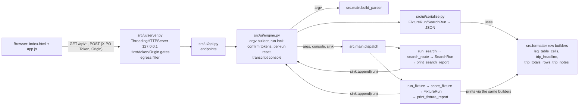

# Plan: a local web UI over the engine (feature 2 of 3)

Branch `feature/ui`, worktree `/home/claude/points-optimizer-ui`, based on
`feature/operating-airline` at `3c104b3`. Baseline: **1603 passed / 13 skipped**
(`.venv/bin/python -m pytest -q -p no:cacheprovider`). Tsuki said "no
questions", so every call below is mine and is stated. Anything only he should
decide is in "Decisions for Tsuki" at the end, with the safe default already
chosen.

## 1. Summary

A small web app that runs on Tsuki's Mac (`.venv/bin/python -m src.ui`) and
opens in his browser at `http://127.0.0.1:8777/`. He can search a route, build
or pick a trip, run it LIVE, REPLAY or OFFLINE, and read the verdicts. It has to
run locally because Seats.aero is blocked from the Claude sandbox.
The UI is a **CLI invocation with structured output**. Each run builds a real
`python -m src.main` argument list, goes through the CLI's own parser and
dispatch, and collects the engine's result objects plus the exact CLI text. So
every refusal, UNKNOWN, WITHHELD, UNVERIFIED and provenance label reaches the
screen from the same code that prints it in the terminal.

## 2. Assumptions & decisions

### What reading the code changed about the brief

1. **Single-route search has no cash price, so it has no POINTS/CASH verdict.**
   `run_search` → `optimize()` ranks awards by `points × cpp + taxes`. Nothing
   in that path compares against a fare. A verdict chip in the search table
   would invent a comparison. The search table instead shows **award space,
   fundability from the wallet, and taxes trust**. One click turns a cell into a
   prefilled New-trip form, where he types the fare and gets a real verdict
   (decision D3).
2. **Single-route search never uses the disk cache.** `optimize()` calls
   `SeatsClient.search()` with no `cache=`, so every CLI search spends at least
   one call, and nothing is archived. The UI keeps that behaviour (parity), and
   the confirm step says so. Changing it is Decision for Tsuki T1.
3. **A long-lived server breaks two "one process = one run" assumptions.**
   `SeatsClient.CACHE`/`CACHE_META` are class-level with **no TTL**. In a server
   that stays up for days, a morning search would answer an evening one. The
   call counter `_calls_made` is class-level too. The UI clears the in-process
   cache before every run, so each UI run behaves exactly like a fresh CLI
   process (the 6-hour disk cache still applies). It keeps the counter, which
   now honestly counts "calls since launch today". One run at a time, under a
   lock (D6).
4. **Pre-existing CLI defect F-1: the per-leg table makes a partnership claim it
   has not earned.** In `print_leg_results` the `else` branch prints
   `none - not a partner` in "Best points path". That is reached by a leg whose
   Seats.aero call **failed** (`PAY CASH (no live pts dat…` + `none: API
   FAILED`) and by a `--new-trip` leg that was **never priced**. On the
   never-priced leg the verdict cell also reads `PAY CASH (no path)`, while its
   own detail line says "NOTHING is claimed about whether a UR transfer partner
   covers SFO->LHR". I reproduced both (network-down Trip B; a two-leg
   `--new-trip`-shaped fixture run `--offline`). A UI that copied the cell would
   repeat the project's recurring failure. Step 6 fixes it in the one shared
   cell builder. It is the **only intended change to CLI output** in this round,
   and it is flagged for the manager.
5. **Observation F-2 (not fixed here): a margin with provenance `none` prints
   `0.00%  (none)`, exit 0.** An offline run of a `--new-trip` fixture has
   nothing priced on points and still prints "Optimizer beats paying cash by
   0.00% (none)". The UI shows exactly that, with the qualifier and the note "No
   points price of any provenance entered this margin." on the number's line
   (parity). Changing it is a CLI decision → T4.
6. **The trip builder takes one cabin for the whole trip.** The brief's form has
   a cabin per leg. `FlightSpec` gets an optional per-leg `cabin`. The CLI never
   sets it, so every CLI-built fixture stays byte-identical (step 10).
7. **No fixture has a 2+ traveller flight leg**, and the UI form cannot make
   one. The WITHHELD-couple state appears only for a fixture made with
   `--new-trip --travelers 2` or edited by hand. It is still in the inventory
   (T-R6).

### Decisions (mine)

| # | Decision | Why |
|---|---|---|
| D1 | **UI run = argv → `build_parser().parse_args(argv)` → `dispatch(args, console, sink)`**. `dispatch` is today's `main()` body minus parsing. `run_fixture`/`run_search` append their structured run object to `sink`, and `dispatch`'s `except` branches append a `RunRefusal(exit_code, kind, message)` | Every flag conflict, refusal and exit code comes from the CLI's own code. "Equivalent command" is `shlex.join(argv)`, shown on every result. Duplicating the dispatch rules in the UI is how the two would drift |
| D2 | **Structured data comes from engine objects; words come from shared builders.** Formatter functions that the UI renders as structure (per-leg table cells, verdict label, trip headline, totals rows, trip notes, residue, footers) are split into `…_rows()`/`…_cells()` builders that return plain text + rich style, and the existing `print_*` functions print from them. Prose blocks (per-leg detail, live banner, replay banner, FX, wallet) are **displayed verbatim** from a recording console. They are never parsed | One source of words. The UI can never say something cleaner than the CLI, because it is the CLI's own sentence. A byte-identical golden test pins the CLI |
| D3 | Search table shows **fundability + taxes status per cabin**, never POINTS/CASH | No cash side exists (finding 1) |
| D4 | Every unknown is JSON `null` **plus** an explicit status field. `inf` → `null`. `json.dumps(..., allow_nan=False)` so a stray `inf`/`nan` fails loudly. When the headline is a range or withheld, the single `beat_cash_pct` is **not sent at all** | The browser cannot render a number it never receives |
| D5 | Security: bind `127.0.0.1`; Host allowlist; per-launch token on **every** `/api/*` request (GET too) via `X-PO-Token` header; `Origin` must match on POST; no CORS; strict CSP with no inline script; server-side **confirm tokens** for anything that can spend calls; key never leaves the server (transcript key line redacted + egress filter on every response body) | Constraint 4. The confirm is enforced by the server, not only by the page |
| D6 | One engine run at a time (process lock). A second run gets HTTP 409 "Another run is in progress" | Class-level caches/counters and `config` FX state are shared by every thread |
| D7 | Before each run: `SeatsClient.CACHE.clear(); SeatsClient.CACHE_META.clear()`. Budget counter **kept** and shown as "since launch" | Finding 3 |
| D8 | Session wallet: loaded at launch from `--wallet PATH` (default `./wallet.json` if it exists). Editable in the UI, held **in memory only, never written**. If it is unchanged from the file the argv uses `--wallet PATH`, otherwise `--balance`/`--card`/`--valuation` flags | His wallet file is his. No default wallet (the CLI rule): with none, runs return the CLI's own exit-2 refusal |
| D9 | Modes: **Trips** = LIVE / REPLAY / OFFLINE. **Search** = LIVE only (the CLI has nothing else) | CLI parity |
| D10 | REPLAY manifests are picked from a **server-side allowlist**: `<config.SNAPSHOT_DIR>/MANIFEST.md` and `tests/fixtures/seats_aero/*/MANIFEST.md` (depth 1, never `trips_endpoint/`). The browser sends an index, never a path | No path traversal; the trips manifest is read by replay itself |
| D11 | Knobs shown: transfer date (default today), flex days 0-7, operating-airline lookup auto/all/off, lookup cap 1-50 (default 10), refresh cache. **Not offered:** `--allow-badge-fallback`, `--fx`, `--valuation-cpp`, `--transfer-increment`, `--max-stranded-points`, `--cache-ttl`, `--snapshot-dir`, `--api-key`, `--html`, `--passengers` > 1 | The safe defaults stay on. `--fx` would mutate global `config` across runs. `--html` writes `results.html` into the working directory |
| D12 | Max-call statement before any LIVE spend. Trip: **(flight legs with both airports) × 25 pages + lookup cap** (cap 0 when lookups are off). Search: **25**. The confirm says one page per search is the only shape seen so far. Optional step 12 adds "the disk cache can answer K of F searches for free" | `MAX_PAGES = 25` is the real ceiling. An honest maximum beats a friendly guess |
| D13 | Results kept in server memory (last 20 runs) and lost at restart. The transcript has a Copy button (he pastes output back to the team) | No new files written |
| D14 | New trips are written by `trip_builder.write_fixture` into `tests/fixtures/trips/` (same as `--new-trip`). Existing names are refused (no `--force` in the UI). Two steps: preview (the builder's own `echo_lines`), then write | Same writer, same validators, same place → T2 |
| D15 | `http://127.0.0.1:8777/` by default. `--port N` (0 = any free port). A busy port fails with a message and never moves silently. Opens the browser unless `--no-open` | One command, as asked |
| D16 | Trip form: 1 traveller fixed, with the hint shown | Constraint 6 |
| D17 | Search IATA codes and dates are checked with `trip_builder.validate_iata`/`validate_date` **before** anything is spent | The CLI search spends a call on a typo; the UI refuses first, with the builder's own wording |
| D19 | The Search tab is a column beside a world map (docs/plans/map-search.md). Two same-origin static files carry its data: `/static/land.json` (generated by `tools/build_land_path.py`) and `/static/hubs.json` (`data/hubs.json`, written only by `src.map_tools capture-hubs`; committed EMPTY). One more script, `map.js`, sets one global `window.POMap`. The right pane is the map OR the results, never both; picks write IATA codes into the same inputs; no engine, API-route or wording change | The map only offers airports the engine accepts, and says in words when it has no data |

## 3. Out of scope

- Hotels in the trip form (feature 3; `--hotel` stays CLI-only). Existing fixtures with hotel legs display normally.
- `--fx`, badge fallback, valuation/increment/stranding knobs, `--html`, multi-passenger search, `--force` overwrite, editing or deleting fixtures, editing `wallet.json` on disk.
- `trips_tools capture` / `yq-check` from the UI (they write evidence files; keep them deliberate).
- An operating-airline lookup from the search view.
- Persisting results across restarts; exports; charts; light theme; accounts; anything that is not bound to 127.0.0.1.
- Any change to scoring, verdicts or exit codes. F-1 changes two **table cells' words** only.
- Cancelling a run in flight.

## 4. Architecture

### 4.1 Components and data flow



The sink and the printer read **the same objects** in the same process run. The
transcript is the printer's output on a recording console: `Console(file=StringIO(),
width=190)`, the same width as `main()`.

### 4.2 Engine refactor (the smallest one that yields structure)

All changes keep CLI output byte-identical (step 1 goldens), except F-1 (step 6).

**`src/main.py`**

```python
@dataclass
class FixtureRun:        # everything the printer reads; built BEFORE any post-scoring print
    args; fixture; wallet; wallet_warnings; transfer_date; ratios
    live_opts; cache; client; replay_selection; manifest_hash   # client is None offline
    outcomes; results; totals; residue                          # totals already carries margin_withheld*, manifest_*
    exit_code: int                                              # 0/3/4, computed exactly as today
    key_source: Optional[str]                                   # resolution.source (+path), NEVER the key/mask

@dataclass
class SearchRun:
    args; trip; date_range; wallet; wallet_warnings
    strategies: List[Strategy]; awards: List[Award]             # awards = client.last_search_awards
    last_error: Optional[str]; pagination_note: str
    calls_spent: int                                            # budget delta around optimize()
    key_source: Optional[str]; exit_code: int

@dataclass
class RunRefusal:
    exit_code: int; kind: str      # "wallet"|"replay_refused"|"value"|"file"|"trips_flags"|"conflict"|"key"
    message: str                   # str(e) or the exact lines printed, verbatim

def score_fixture(args, console) -> FixtureRun   # prints ONLY the pre-scoring banners it prints today
                                                 # (key, relocation, header, wallet, FX, valuation, flags, replay banner)
def print_fixture_report(run, args, console) -> int   # live banner … residue … footers; returns run.exit_code
def run_fixture(args, console, sink=None) -> int      # = score → sink.append → print_fixture_report
def fixture_footer_lines(results, totals) -> List[Tuple[str, str]]   # (text, rich style); main's 5 footers
def unfundable_reason(award) -> str                   # the if/elif chain now inline in run_search
def search_route(args, console) -> SearchRun; print_search_report(run, args, console) -> int
def run_search(args, console, sink=None) -> int
def dispatch(args, console, sink=None) -> int         # today's main() body after parse_args/Console
def main() -> int: return dispatch(build_parser().parse_args(), Console(width=190))
```

Why this is safe: `apply_live`, `evaluate_trip`, `annotate_live_verdicts` and
`trip_totals` print nothing (checked: no `print(` in the scoring modules), so
moving `trip_totals` and the withheld logic above the first table changes no
byte. The coder must confirm `trip_totals` does not mutate `results`. The
golden test proves the rest.

**`src/formatter.py`** — builders; each `print_*` becomes "build, then print":

| Builder | Returns | Printed by |
|---|---|---|
| `leg_table_cells(r) -> LegCells` | 12 cells; each cell = `List[Segment(text, style)]` + `kind` (below) | `print_leg_results` |
| `verdict_label(r) -> Segment list` + `verdict_kind(r)` | e.g. `[("WITHHELD (taxes unknown)","bold red"), (" !SENSITIVE","yellow")]` | inside `leg_table_cells` |
| `trip_headline(totals) -> Headline` | `state` single/range/withheld/not_fundable, `text`, `qualifier` (today's `hash_suffix`), low/high rows, withheld reason, funding note | `print_trip_totals` |
| `trip_funding_banner(totals) -> List[Segment]` | the two pre-table banners | `print_trip_totals` |
| `trip_totals_rows(totals) -> List[Row(label, value, label_style, value_style)]` | every row, in order, conditionals included | `print_trip_totals` |
| `trip_notes(totals, today) -> List[Segment]` | every line printed after the totals table | `print_trip_totals` |
| `residue_rows(report) -> List[Row]` | residue table rows | `print_residue_report` |
| `print_leg_detail_one(r, c)`, `print_live_leg_detail_one(r, c)`, `print_alternatives_one(r, c)` | the loop bodies, unchanged | the existing loops |

`kind` is set from **engine fields, never from text**:
`cash` cell → `unknown` iff `r.best_cash is None`; `surcharge` → `none` /
`known` / `unknown` from `r.surcharge`; `score_points` → `number` / `range`
(verdict_sensitive) / `floor` / `break_even` / `none`; `verdict` →
`points` / `cash` / `cash_qualified` (every CLI-yellow verdict, including
`trip out of points`) / `withheld` (the three CLI-red WITHHELD labels);
`provenance_points` → `live` / `snapshot` / `badge` / `no_space` / `api_failed`
/ `budget` / `unreadable` / `none`.

**`src/optimizer.py`**: extract `search_award_cash(trip, award) -> (known, cash_usd, note, apd_floor)` from the `optimize()` loop (the `cash_known` / `below_duty` / `apd_floor` / `cash_cost_note` lines). `optimize()` calls it, so behaviour is unchanged. The UI calls it for **unfundable** awards too, so every search cell goes through the same tax-trust rules.

**`src/models.py`**: add `MetalLookup.parser_label_text` (a public property = `_parser_clause().strip()`). `render()` is unchanged. The UI uses it to decide whether the UNVERIFIED tag appears on a metal line.

**`src/trip_builder.py`** (step 10): `FlightSpec.cabin: Optional[str] = None`. `build_fixture` uses `spec.cabin or cabin` for that leg's `cabin` and description. The top-level description reads `cabin Y (economy)` when all legs agree and `cabins by leg: L1 J, L2 Y` otherwise. No CLI path sets it.

### 4.3 File layout

```
src/ui/__init__.py
src/ui/__main__.py      launch: --port (8777), --wallet, --no-open; prints the URL; Ctrl-C stops
src/ui/server.py        ThreadingHTTPServer; gates (Host, token, Origin, method, size); static allowlist;
                        security headers; egress filter; one-line request log (method path status)
src/ui/api.py           endpoint handlers (4.5)
src/ui/engine.py        argv building, run lock, confirm tokens, per-run reset, transcript + key-line redaction,
                        replay-manifest allowlist, session wallet, run store (last 20)
src/ui/serialize.py     FixtureRun / SearchRun / TripFixture → JSON-safe dicts
src/ui/static/index.html  app.css  app.js      (no build step, no inline script)
tests/_cli_golden.py                  scenario runner + normalizer (shared by generator and test)
tests/fixtures/cli_golden/*.txt       golden transcripts from 3c104b3
tests/test_cli_output_unchanged.py
tests/test_ui_serialize.py  tests/test_ui_security.py  tests/test_ui_api.py  tests/test_ui_static_rules.py
docs/design/ui-mockup.html            (built by the coordinator from 4.8)
```

`models._reason_codes_in_source()` globs `src/*.py` only, so `src/ui/` cannot disturb way ten.

### 4.4 Security (constraint 4, made concrete)

| Gate | Rule | Response on failure |
|---|---|---|
| Bind | `127.0.0.1` only; never `0.0.0.0`, never `::` | — |
| Host | exactly `127.0.0.1:<port>` or `localhost:<port>`, on **every** request (static included) | 421, empty body |
| Token | `secrets.token_urlsafe(32)` per launch; delivered only in `<meta name="po-token">` of `/`; required as `X-PO-Token` on **every** `/api/*` (GET too); `hmac.compare_digest` | 403 `{"error":"stale_page","message":"This page is from an earlier launch of the app. Reload it."}` |
| Origin | POST must carry `Origin` equal to `http://127.0.0.1:<port>` or `http://localhost:<port>` | 403 |
| Method/type | POST bodies `Content-Type: application/json`, ≤ 64 KB, strict JSON object; OPTIONS → 405; no `Access-Control-*` header ever | 400 / 405 / 413 |
| Spend | LIVE trip run and search run need a `confirm_id` from their preflight: single use, 5-minute life, bound to a SHA-256 over the canonical request (trip id, fixture **file bytes**, mode, options, wallet) | 409 `{"error":"confirm_required"}` / `"confirm_stale"` ("The trip or options changed since you confirmed. Confirm again.") |
| Writes | new-trip create needs token + Origin + a `draft_hash` from the preview | 409 |
| Key | never in JSON or logs. The transcript's key line (`resolution.describe()`'s first line) is replaced by `Seats.aero key: (masked key not sent to the browser)   (source: <source>)`. **Egress filter**: before any body is sent, if it contains the raw key or `mask_key(key)` (keys ≥ 8 chars) the server sends 500 `{"error":"internal","message":"Refused to send a response that contained key material."}` and logs only that fact | — |
| Errors | engine refusals (`RunRefusal.message`, `TripBuilderError`, `WalletError`) are user-facing, verbatim. Anything unexpected → `{"error":"internal","message":"Unexpected <ExceptionType>; see the terminal."}` with the traceback printed to the **terminal only** | — |
| Headers | `Content-Security-Policy: default-src 'none'; script-src 'self'; style-src 'self' https://fonts.googleapis.com; font-src https://fonts.gstatic.com; connect-src 'self'; img-src 'self' data:; base-uri 'none'; form-action 'none'; frame-ancestors 'none'`; `X-Content-Type-Options: nosniff`; `Referrer-Policy: no-referrer`; `X-Frame-Options: DENY`; `Cache-Control: no-store` on `/api/*` | — |
| XSS | app.js builds DOM with `createElement` + `textContent` only. **Banned in app.js** (static test): `innerHTML`, `outerHTML`, `insertAdjacentHTML`, `document.write`, `eval(`, `new Function`, string `setTimeout(`. Also banned: `|| 0` and `?? 0` (the JS spelling of unknown→$0) | — |
| Static | fixed map `{"/": index.html, "/static/app.js", "/static/app.css"}`; nothing is joined from the URL | 404 |
| Trip ids | resolved only against the current listing of `tests/fixtures/trips/` (names matching `trip_builder._SAFE_NAME`); never joined from the URL | 404 |

Threat model stated in the README: another website open in his browser, and
DNS rebinding. Local malware is out of scope (it could read `~/.zshrc`).

### 4.5 API contract

All JSON. All `/api/*` need `X-PO-Token`. Numbers that are unknown are `null`
with a status beside them.

| Method, path | Body | Returns |
|---|---|---|
| `GET /api/state` | — | `{today, wallet:{balances:{UR:160000\|null}, cards[], source:"wallet.json"\|"entered in this session (not saved)"\|null, describe_lines[], warnings[], error:null\|str}, key:{found:bool, source:"environment"\|…\|null, error_text:null\|str}, modes:{live:bool, live_reason:str\|null, replay_manifests:[{id, label, rows}], replay_reason}, calls:{since_launch, cap:1000, remaining}, paths:{snapshot_dir, cache_dir, trips_dir}, relocation_lines[], parser:{search:PARSER_VERSION, trips:TRIPS_PARSER_VERSION, trips_label}, running:bool}` |
| `POST /api/wallet` | `{balances:{UR:"160000"\|""}, cards:[...], valuations:{}}` | `/api/state.wallet`, or `{error:"wallet", message}` (the `WalletError`/`validate_wallet` text) |
| `GET /api/trips` | — | `[{id, file, name, legs, flights, hotels, max_flight_travellers, fixture_has_points_prices:bool, live_only:bool (LIVE_ONLY_FLAG present), load_error:null\|str}]` (`*_answer.json` excluded; unloadable files listed with `load_error`, never hidden) |
| `GET /api/trips/{id}` | — | `{id, name, description, source, flags[], legs:[{id, kind, description, date, origin, destination, travelers, cabin, nights, cash_options:[{label, amount, currency, source, captured_on}], points_candidates:[{label, program, points, source, source_note}]}]}` (no scoring) |
| `POST /api/trips/draft` | `{name, cabin, legs:[{origin, destination, date, cabin, cash}]}` | `{ok, echo_lines[], draft_hash}` or `{ok:false, errors:[{leg:int\|null, field, message}]}` |
| `POST /api/trips/create` | draft body + `draft_hash` | `{id, path, lines:["Wrote …", "This fixture has NO points prices. Score it LIVE or REPLAY."]}` or `{error:"refused", message}` |
| `POST /api/trips/{id}/preflight` | `{mode, options:{transfer_date, flex_days, trips, trips_cap, refresh, manifest_id}}` | `{mode, argv_display, max_calls, breakdown:{flight_legs, pages_per_search:25, lookup_cap}, cache_answerable:null\|int, calls:{since_launch, cap}, archive_dir, confirm_id:null\|str, blocked:null\|{kind, message}}` (`blocked` = wallet error, no key, …; `confirm_id` only for LIVE) |
| `POST /api/trips/{id}/run` | preflight body + `confirm_id` (LIVE) | `TripRunJSON` (4.6) |
| `POST /api/search/preflight` | `{origin, destination, date, date_to}` | `{max_calls:25, window:{from, to}, confirm_id, blocked, argv_display}` or field errors |
| `POST /api/search/run` | same + `confirm_id` | `SearchRunJSON` |
| `GET /api/runs/{run_id}` | — | a stored result |

Static (no token; the same headers as every response): `/static/land.json` = `{"w","h","lat_min","lat_max","d"}`, the land path and its projection; `/static/hubs.json` = `data/hubs.json` (shape in docs/plans/map-search.md 4.2); a missing hub file is a 404 JSON, which the page names as "unreadable", never as empty. D19.

### 4.6 JSON shapes (what the serializer emits)

```
TripRunJSON {
  run_id, kind:"trip", mode:"live"|"replay"|"offline", started_at, duration_s,
  exit_code, exit_label: "OK"|"ERROR — NOTHING SCORED"|"WALLET ERROR"|"WITHHELD"|"NOT EXECUTABLE",
  argv_display,                       // ".venv/bin/python -m src.main --trip-fixture trip_b_europe.json …"
  refusal: null | {kind, message},    // exit 1/2: nothing below is present
  trip: {id, name, description, source, flags[]},
  context: {key_source|null, relocation_lines[], wallet_lines[], wallet_warnings[], unusable_currencies_line|null,
            transfer_date_line, fx_lines[], valuation_line},
  calls: {this_run: {search:int, trips:int} | null /*replay*/ | {search:0,trips:0} /*offline*/,
          since_launch, cap},
  live_banner_lines: [{text, style}] | null,     // verbatim print_live_banner (+ parser-disagreement lines)
  replay: null | {manifest_hash, selection, parser_at_capture, parser_now, reparsed:bool, banner_lines:[{text,style}]},
  metal_summary: null | {mode, cap, candidates, requests_sent, served_from_cache, replayed, by_status{},
                         gaps:int, rate_limited:bool, parser_label:str},
  funding_banner: [{text, style}],
  headline: {state:"single"|"range"|"withheld"|"not_fundable",
             pct:null|num (single only), pct_low:null|num, pct_high:null|num (range only),
             text,                      // exactly the CLI value cell, e.g. "2.04% - 11.03%" (parity checks);
                                        // the page draws the range from pct_low/pct_high with an en dash
             qualifier,                 // exactly the CLI suffix, e.g. "(badge)", "(snapshot mh_…)"
             low_row:null|{label,value}, high_row:null|{label,value},
             range_parts:[{part:"surcharge"|"award_taxes"|"apd", legs:[ids]}],
                                        // parts = the CLI's own _names_surcharge / legs_taxes_unknown / legs_apd_unknown;
                                        // legs from legs_surcharge_unknown_ids / legs_taxes_unknown_ids / legs_apd_unknown_ids
                                        // (may be [] for surcharge when only a rejected option carries it)
             withheld_reason:null|str, funding_note:null|str,
             provenance, provenance_note, legs_counted_text},   // "0 of 4 legs live"
  totals_rows: [{label, value, label_style, value_style}],
  trip_notes: [{text, style}],        // mixed/badge/withheld sentence, range caveat, NOT LOOKED UP on…, SENSITIVE, FX
  residue_rows: [...], footer_lines: [{text, style}],
  legs: [LegJSON],
  transcript                          // full plain-text CLI output, key line redacted
}

LegJSON {
  id, kind, description, short, origin, destination, date, travelers, cabin,
  cells: {leg, what, cash, cash_pts, path, points, surcharge, surch_source, score_points, score_cash,
          provenance, verdict}  // each {segments:[{text,style}], kind}
  verdict: {code /*r.verdict*/, chip:"points"|"cash"|"cash_qualified"|"withheld",
            sensitive:bool, date_shifted_to:null|date, demoted_for_trip_balance:bool, reason /*verdict_reason*/},
  numbers: {cash_usd:null|num, cash_pts:null|int, points_required:null|int,
            score_points:null|num, score_low:null|num, score_high:null|num, floor:null|num,
            break_even:null|num, break_even_subject:"surcharge"|"taxes_plus_surcharge"|null,
            margin_usd:null|num, margin_pct:null|num, score_cash:null|num,
            mandatory_fees_usd:null|num, apd_added_usd:null|num},
  cash: null | {label, amount, currency, amount_usd, foreign:bool, rate_unconfirmed:bool,
                provenance /*leg.cash_provenance*/, captured_on},
  points: null | {label, program, points, source, source_note, attribution_assumed:bool,
                  unverified:bool /* source not seats_aero_live */, path_summary, spend_summary, stranded},
  taxes: {status:"known"|"policy_complete"|"verified_complete"|"unknown"|"unconvertible"|"reported_unusable"|"n/a",
          usd:null|num, amount:null|num, currency, note},
  surcharge: null | {known:bool, render, low:null|num, point:null|num, high:null|num,
                     confidence, matched_rule, source, notes, cannot_change_verdict:bool},
  apd: {state:"added"|"stated_not_added"|"unknown"|"none", line:null|str},   // from reason codes APD_*; line = the warning, verbatim
  metal: null | {status, reason_code, line /*metal.render()*/, extra_lines /*metal_lines()[1:]*/,
                 unverified:bool /*parser_label_text != ""*/, carriers[], possible_carriers[],
                 served_from_cache, fetched_at, replayed},
  legacy_metal_line: null|str,        // "metal: VS (source: …), cabin J" as printed
  other_lookups: [{title, lines[]}],
  live: null | {state, line /*outcome.render()*/, pagination_note, served_from_cache, cache_fetched_at,
                cache_age_min, replayed_from_snapshot, snapshot_name, snapshot_captured_at,
                snapshot_parser_version, points_provenance},
  superseded_lines[], date_shift_line:null|str,
  flexible: [{line, date_match, advisory}],
  alternatives_lines: [{text, style}],
  reasons: [{code, detail}], warnings[], notes[], data_flags[],
  cli_lines: [{text, style}]          // print_leg_detail_one + print_live_leg_detail_one + print_alternatives_one
}

SearchRunJSON {
  run_id, kind:"search", mode:"live", exit_code, exit_label, argv_display, refusal,
  route:{origin, destination, from, to}, passengers:1,
  state:"ok"|"api_error"|"no_awards"|"none_fundable",
  api_error:null|str, coverage_note, coverage_incomplete:bool,
  trips_footer,                        // SINGLE_ROUTE_TRIPS_FOOTER, verbatim
  header_line:null|str,                // "Seats.aero returned N award(s) … NONE of them can be funded …" verbatim
  unknown_cash_line:null|str,          // "{n} strategies above carry cash that is UNKNOWN (NOT $0) …" verbatim
  rows:[{date, program, source_code, cabins:{Y|W|J|F: null | Cell}}],
  context:{…as trip…}, calls:{this_run, since_launch, cap}, transcript
}
Cell { cost, seats, carriers[], direct:null|bool,
       taxes:{known, usd:null|num, amount:null|num, currency, note, apd_floor:null|num},
       fundable:bool, rank:null|int, path_summary:null|str, stranded:null|int,
       total:null|num, total_is_floor:bool, why_not:null|str /*unfundable_reason*/,
       indirect_path:null|str, source_note, parser_version }
```

A `null` cabin = the row said that cabin has no space (a finding). It is not an
unknown: a row the parser could not read never reaches the table, and it is
counted in `coverage_note`.

### 4.7 Design system (the spec; implement exactly)

Rewritten for the restyle to direction C ("Graphite"): a blue-black ground, one blue
accent for identity and one coral accent for the single primary action. The approved
reference is `docs/design/restyle-ref/DirectionC.dc.html` (+ `.png`); the decisions
are in `docs/plans/ui-restyle.md`. Single-theme dark.

**Tokens** (`:root` in app.css): `--bg #0F141B` page ground · `--panel #171D26` panels, table body, drawer, modal, mode cards · `--raised #1F2733` inputs, hover rows, selected rows, table header band · `--line #2A3442` every hairline · `--text #E9EDF3` primary text · `--muted #8C98A8` labels, secondary text · `--accent #7DA9FF` wordmark mark, active tab, selected trip/row, active mode card, IATA codes, links, focus ring, input focus (`--accent-ink #0B1220` text on an accent fill; `--accent-tint rgba(125,169,255,.10)` selection tint) · `--accent2 #FF8A65` the ONE primary action (`.btn-primary`: Run, Run search, Spend up to N calls, Write, Apply, Score against a fare; `--accent2-ink #1A0E08`, hover `--accent2-hover #FFA184`). Semantic (never the accent): `--warn #F0B85A` caution text, chip borders, flags (`--warn-bg #2B2314` / `--warn-line #6A5320` for warn fills) · `--win #5FD3A0` POINTS only, never a cash figure · `--unknown #8791A0` the dashed UNKNOWN border. Radius `--radius 6px` (panels, buttons, inputs, cards, modal), `--radius-chip 4px` (chips). `--glow` is a radial gradient on `body` behind the top-left of the page.

**Type**: Figtree (Google Fonts `<link>`, 400/500/600) for UI text; section labels 11px 600 uppercase `letter-spacing:.06em` `--muted`; the wordmark 16px 600 sentence case with a 10px accent square before it; tabs 14px 500 sentence case. Red Hat Mono (400/500) with `font-variant-numeric: tabular-nums` for IATA codes, flight numbers, miles, dollars, dates, leg ids. Fallbacks: `-apple-system, "Helvetica Neue", Arial, sans-serif` / `ui-monospace, "SF Mono", Menlo, monospace`. Scale 12/13/14 (base)/16/20, plus 28 for the headline value only. No shadows except the drawer (`0 0 0 1px var(--line), -12px 0 32px rgba(0,0,0,.55)`). Exactly two gradients: the page glow and the WITHHELD hatch. No emoji. No version numbers in UI copy (the project's no-changelog rule).

**Chips** (11px, uppercase mono, 1px border, radius 4px, padding 1px 7px). Rectangular so an edge reads as an edge and a hatch as a hatch. Form carries the meaning as well as colour:

| Chip | Form | Text |
|---|---|---|
| POINTS | fill `rgba(95,211,160,.16)`, border and text `--win` | `POINTS` |
| CASH | transparent, border `--muted`, text `--text` | the CLI label, e.g. `PAY CASH`, `PAY CASH (no path)` |
| CASH, qualified | as CASH + 3px left border `--warn`; the parenthesis in `--warn` | e.g. `PAY CASH (pts unpriced)`, `PAY CASH (no live pts data)`, `PAY CASH (trip out of points)` |
| WITHHELD | border and text `--warn`, background `repeating-linear-gradient(135deg, rgba(240,184,90,.16) 0 3px, transparent 3px 7px)` | `WITHHELD (surch unknown)` / `(taxes unknown)` / `(APD unknown)`; headline `WITHHELD` |
| UNKNOWN | `1px dashed var(--unknown)`, text `--text` | always the literal `UNKNOWN`. Never blank, never `—`, never `$0` |
| UNVERIFIED | small-caps tag, no border, `--warn`, 12px, `letter-spacing:.06em` | `unverified` (small caps) |
| !SENSITIVE / !DATE | tag in `--warn` after the verdict chip | as CLI |
| Range | `$a – $b` mono (en dash, thin spaces); label under it, 12px `--warn` uppercase | e.g. `award TAXES` |
| Mode pill | 999px, 12px 500 sans, 24px tall. LIVE: fill `--accent`, text `--accent-ink`. REPLAY: border `--text`. OFFLINE: border `--muted`, text `--muted`. No key: `LIVE UNAVAILABLE` border and text `--warn` | |
| Wallet chips | 999px, mono 12px, border `--line`; `NO WALLET` / `WALLET ERROR` in the warn-fill form (`--warn` on `--warn-bg`, `--warn-line` border) | |
| Key chip | hidden when a key is found; `key: not found` in the warn-fill form when it is not | |
| Exit chip | `exit 0 · OK` (neutral), `exit 3 · WITHHELD` (WITHHELD form), `exit 4 · NOT EXECUTABLE` (WITHHELD form), `exit 1 · NOTHING SCORED`, `exit 2 · WALLET ERROR` (border `--warn`) | |

**Warn fills** (`banner-error`, `no-wallet`, the flags panel, refusals, the funding banner, a broken trip row): `--warn-bg` fill, 1px `--warn-line` border, radius 6px, text `--text`, and a 3px `--warn` left edge - the edge is the form, the colour the second signal.

**Segments**: rich styles become classes through one table: `red`/`bold red` → `seg-alert` (`--warn`, 600) · `yellow`/`bold yellow` → `seg-caution` (`--warn`) · `green`/`bold green` → `seg-ok` (`--text`) · `cyan`/`bold cyan` → `seg-replay` (`--text`, dotted underline) · `dim` → `seg-dim` (`--muted`) · `magenta`/`bold magenta`/none → plain. Chip-worthy cells use their `kind`, not their style.

**Mode selector**: three cards on the existing buttons (`flex: 1 1 0; min-width: 200px; max-width: 420px` - one width on a line, one per row at 400px; `--panel` on `--line`, radius 6px, 14px 16px padding; title 13px 600 `.04em`, caption 12px `--muted`). The pressed card: `--accent` border + inset ring, `--accent-tint` fill, title in `--accent`. Disabled: opacity .55. The run strip is a column - mode cards · the key-error fold · the manifest select · a run row - and the run row is a flex row in which the REPLAY-unavailable note is the only flexible item and the buttons are `flex: none`, so a long path can never push RUN out of the strip; at 400px the note takes a line and the buttons wrap under it, right-aligned.

**Trip list**: rows 12px 14px, radius 6px, no left edge; hover `--panel`; the current row `--accent-tint` with a `--line` border and its name in `--accent`. Kinds by class from app.js: `.trow-trip` plain · `.trow-search` (a search request, not a trip) 3px `--line` left rail and a quiet 400-weight `--muted` name · `.trow-broken` (cannot load) the warn-fill form. Captions (`NOT A PER-LEG TRIP`, `CANNOT LOAD`, flags) are unchanged; never dashed (dashed means UNKNOWN).

**Layout**: 48px top bar (`rgba(15,20,27,.88)` + `backdrop-filter: blur(10px)` so the glow shows through and the bar stays legible when scrolled; wordmark "Points Optimizer", tabs Search / Trips, mode pill, calls counter, wallet chips, key chip). Content max 1440px, 16px gutters. Tables: 32px rows, 6px 10px cell padding, 13px, zebra off, header band `--raised` 11px uppercase `.06em`, hover `--raised`, selected row `--raised` + inset 3px `--accent`, LEG and VERDICT pinned with opaque backgrounds (`tr { background: var(--panel) }`, pinned `td { background: inherit }`). Buttons 36px (small 28px), 13px 600 sentence case, `--panel` on `--line`; inputs `--raised`, radius 6px, focus border `--accent`. Drawer: right side, 440px, sticky ≥1180px, fixed full-height sheet below, scrolls on its own. Below 720px: tables scroll horizontally inside their own `overflow-x:auto` container, the drawer becomes a full-screen sheet, the top bar wraps to two rows. Focus: 2px `--accent` outline, offset 2px. Rows are focusable (`tabindex=0`); Enter opens, Esc closes. Nothing widens the page at 400px.

### 4.8 Screen inventory

**Example data is marked [EX-…]**:
- [EX-OFF] Trip B `--offline --balance UR=160000 --card "Chase Sapphire Preferred" --transfer-date 2026-09-15`, real output of this commit.
- [EX-LIVE] Trip B LIVE against the **synthetic** stub in `tests/test_metal_end_to_end.py` (Aeroplan row from the real SFO-MAD capture, re-dated; VS J award + one VS19 itinerary on B4). It is not a real Seats.aero answer, and the mockup must say "EXAMPLE".
- [EX-DOWN] the same run with the network refused.
- [EX-SRCH] the real `tests/fixtures/seats_aero/sfo_mad_real.json` row (captured 2026-09-08).

Every string in `code` is exact user-facing text.

#### G. Global chrome (always visible) — `data-testid` in brackets

| Element | Content | Source |
|---|---|---|
| Wordmark [`wordmark`] | `POINTS OPTIMIZER` | static |
| Mode pill [`mode-pill`] | `LIVE` / `REPLAY` / `OFFLINE` = mode of the next run on the Trips tab; always `LIVE` on Search; `LIVE UNAVAILABLE` when there is no key and LIVE is selected | UI state + `/api/state.key` |
| Calls counter [`calls-counter`] | `CALLS 5 this run · 5 since launch / 1,000` [EX-LIVE]. Offline result: `CALLS 0 this run (offline: no transport)`. Replay: `CALLS 0 this run (replay asks nothing)`. Tooltip/second line: `Seats.aero also counts your other runs today, which this tool cannot see.` | `calls.this_run`, `calls.since_launch` |
| Wallet chips [`wallet-chip-UR`] | `UR 160,000`; null balance → `UR UNCONSTRAINED`; no wallet → `NO WALLET` (border `--warn`). Click → W panel | `/api/state.wallet` |
| Key [`key-source`] | `key: environment` / `key: repo .env` / `key: user config` / `key: not found` (source only; never masked). Decision (restyle): rendered only when `key.found` is false, as `key: not found` in warn form; when found the element is hidden and the run-details box carries the source. | `key.source` |
| Tabs [`tab-search`, `tab-trips`] | `SEARCH` `TRIPS` | |

#### W. Wallet panel [`wallet-panel`]

- Rows: currency · balance input. A blank balance means held, balance not supplied. Remove row = not held. Cards: one text row per card. Source line: `from wallet.json` or `entered in this session (not saved)`.
- Help line (README wording): `A number: held, that many points, the ceiling applies. Blank: held, balance not supplied, NO ceiling. Removed: NOT HELD. Absent is not zero and zero is not unconstrained.`
- Lines shown under the rows: `wallet.describe()` verbatim, e.g. `  UR: 160,000   valued at 1.00 cents/point` / `  cards: Chase Sapphire Preferred`; `validate_wallet` warnings verbatim, prefixed `!`.
- Buttons: `APPLY FOR THIS SESSION` / `CANCEL`. Footnote: `Not written to disk.`
- Error state: `Wallet error: <WalletError text>`.
- No-wallet banner (both tabs) [`no-wallet`]: `No wallet. The tool refuses to assume which cards and points you hold, because a default wallet changes real answers. Add balances in the wallet panel, or start the app with --wallet wallet.json.`

#### S. Search view

**S0 Map** [`map-pane`] (D19; from 900px, beside a 360px column that holds S1; not displayed below 900px). Column heading `Where are you flying?` and subline `Type an airport or city, or pick it on the map.` above S1. The pane: SVG [`map-svg`] (aria-label `World map of airports Seats.aero tracks`) with the land [`map-land`], one marker per plotted airport [`map-hub-<IATA>`] (hollow dot; IATA label at zoom ≥ 3 or when picked; picked = filled + halo), one per cluster [`map-cluster-<IATA>`] (count; click opens the list [`map-cluster-list`] of [`map-pick-<IATA>`] rows, title = the shared city or `{n} airports near {City}`, subline `{n} airports Seats.aero tracks · pick one`, close `Close list`, Esc returns focus to the marker), the route [`map-route`] (dashed great circle between the two picks), controls `Zoom in` [`map-zoom-in`] `Zoom out` [`map-zoom-out`] `Reset view` [`map-reset`]. Footer: status [`map-status`] = `NO AIRPORT DATA - run "python -m src.map_tools capture-hubs" on your Mac. The map plots nothing until then.` (empty file) / `AIRPORT DATA UNREADABLE - /static/hubs.json could not be read ({reason}). The map plots nothing.` (404, bad JSON) / `Click an airport to set From.` / `Click an airport to set To.` / `The line is your route, not availability. Award space appears only after the search runs.`, with ` · {CODE} is not on this map. It can still be searched.` appended for a typed code the map does not plot; legend `airport Seats.aero tracks` · `several airports - click to list` · `Drag to pan · scroll to zoom`; provenance [`map-provenance`] `{N} airports Seats.aero tracked on {YYYY-MM-DD} · {K} not plotted ({J} not in data/airports.csv, {M} without coordinates)`. A click fills the first empty of From, To, then replaces To. Autofill under From/To [`search-suggest-from` / `-to`, rows `suggest-<IATA>`]: exact code, code prefix, city prefix, name/city substring, ties by route count, at most 8; ArrowUp/Down/Enter/Esc. Once a run exists, `Show map` / `Show results` [`search-pane-toggle`] swaps the pane between the map and the result [`search-result`]; S3/S4 render inside `search-result`.

**S1 Strip** [`search-strip`]: `FROM` [`search-from`] · `TO` [`search-to`] · `DATE` [`search-date`] · `TO DATE` (optional, placeholder `+30 days`) [`search-date-to`] · `CABIN` All/Y/W/J/F (display filter only; it does not change the request) [`search-cabin`] · `RUN SEARCH` [`search-run`].
Line under it [`search-window`]: `Searches 2027-01-15 to 2027-02-14 · 1 traveller (award prices are per seat) · single-route search is always LIVE and does not use the disk cache.`
Field errors (inline, verbatim from the builder), e.g. `From: 'SOF' is not an airport this tool knows. … No correction is being suggested: a near-miss suggestion on an airport code is how MRY becomes SFO.`

**S2 Confirm** [`search-confirm`]: `This search can spend up to 25 Seats.aero calls: one per results page (one page is the only shape seen so far). Calls since launch: 5 of 1,000. Seats.aero also counts your other runs today, which this tool cannot see.` Buttons `SPEND UP TO 25 CALLS` [`search-confirm-go`] / `CANCEL`. Shows `Equivalent command: <argv_display>`.

**S3 States** (the table area):

| State [`search-state`] | Shown |
|---|---|
| idle | `Search a route. Results show award space, whether your wallet can fund it, and whether the taxes are trusted. A single-route search has no cash price, so it cannot say POINTS or PAY CASH: add an award to a trip to score it.` |
| no key | the `KeyResolutionError` text verbatim, the button disabled |
| running | `Asking Seats.aero… nothing is shown until the whole answer is in.` + elapsed seconds |
| `api_error` | `Seats.aero could NOT be reached: <last_error>` / `This is an API failure, NOT a finding of no award availability. No conclusion about award space can be drawn from this run.` (verbatim; no table) |
| `no_awards` | `Seats.aero returned no award availability for this route and date range.` + the coverage line directly under it (a truncated answer must never read as a clean empty one) |
| `none_fundable` | `header_line` verbatim, then the full table, every cell NOT FUNDABLE with its reason |
| `ok` | the table |
| refusal | `exit N · …` chip + `refusal.message` verbatim |

**S4 Table** [`search-table`], inside [`search-table-scroll`] (overflow-x):
Columns `DATE` · `PROGRAM` · `Y` · `W` · `J` · `F` (hidden by the cabin filter). A row = (date, program). Cell [`cell-<date>-<source>-<cabin>`]:
- line 1: miles mono `50,000` + seats `9 seats` (`--smoke`);
- line 2: taxes `$32.36` (mono) or the `UNKNOWN` chip; `≥` total when `total_is_floor`;
- line 3 mini-chip: `FUNDABLE #1` (CASH form, i.e. neutral — **never** green; green means points win) / `NOT FUNDABLE` (`--smoke` text) / `INDIRECT` (border `--warn`).
- A cabin with no space on that row: dim text `no space` (a finding; not blank, not `—`).
Under the table, always [`search-footer`]:
`Seats.aero result coverage: <coverage_note>` (in `--warn` if it contains `INCOMPLETE`) · `operating airline: NOT LOOKED UP - single-route search does not call the trips endpoint; use --trip-fixture or \`python -m src.trips_tools capture\`` · `unknown_cash_line` when present · wallet lines · FX block collapsed as `FX rates used (table as of 2026-09-08) — 3 rates, every one CONFIRM BEFORE TRUSTING` (expands to `fx_lines` verbatim) · `Equivalent command`.
[EX-SRCH] row: `2027-01-15 · Air Canada Aeroplan` · Y `50,000 · 9 seats` / `$32.36` / `FUNDABLE #1` · W `no space` · J `no space` · F `no space`.
[EX-SRCH-synthetic] second row for the UNKNOWN state: `2027-01-16 · Singapore KrisFlyer` · J `88,000 · 2 seats` / `UNKNOWN` / `FUNDABLE #2` — mark as synthetic.

**S5 Search drawer** [`drawer`]:
Header `SFO → MAD · 2027-01-15 · Air Canada Aeroplan · Y`, then:
- `MILES` `50,000` · `SEATS` `9` · `POSSIBLE CARRIERS` `AC, LH, UA, VL` (`award.candidate_carriers`).
- `TAXES` `$32.36 (CAD 44.60)` + tag `CONFIRM BEFORE TRUSTING` when the currency needs confirmation. Unknown: UNKNOWN chip + `cash_cost_note` verbatim (it includes the UK APD floor sentence when there is one).
- `FUNDING` `path_summary` (e.g. `UR 50,000 -> Air Canada Aeroplan 50,000 @ 1:1 [Chase Sapphire Preferred]`), `stranded`, `rank #1 of N`. Not fundable: `why_not` verbatim (e.g. `reachable only INDIRECTLY - <path>` / `not a transfer partner of any currency you hold` / `a transfer partner, but no fundable path: the balance (or the stranded-points limit) cannot cover it` / `the response named no program it could be attributed to`).
- `TOTAL AT 1¢/PT` `$532.36`, or `≥ $X` with `a floor: the unknown cash is not in it`.
- `OPERATING AIRLINE` `NOT LOOKED UP - single-route search does not call the trips endpoint` + `the possible carriers are AC, LH, UA, VL` (from the row list). Never a carrier.
- `PROVENANCE` `seats_aero_live · <source_note>` · `parser 2026-09-10.taxes-trust`.
- `NO VERDICT` box: `A single-route search has no cash price to compare against, so it cannot say POINTS or PAY CASH. Add it to a trip with the fare you found.` Button `SCORE AGAINST A FARE →` [`drawer-to-trip`] opens T5 prefilled with From/To/Date/Cabin; cash left empty.

#### T. Trips view

**T1 List** [`trip-list`] (left column; top on phones). Row [`trip-row-<id>`]: name · `7 legs · 4 flights · 3 hotels` · tags: `NO POINTS PRICES — LIVE OR REPLAY ONLY` (live_only), `2+ TRAVELLERS ON A FLIGHT — NOT SCORED ON POINTS` (`max_flight_travellers > 1`; the headline is WITHHELD whenever that leg has a points price, i.e. LIVE, REPLAY, or a fixture with badges), `CANNOT LOAD` + `load_error` verbatim. Button `+ NEW TRIP` [`new-trip`].

**T2 Trip detail, before a run** [`trip-detail`]: name, description, `Source: …`; flags block titled `Data problems flagged, NOT silently fixed` (trip `flags` verbatim; for UI/CLI-built trips this includes `LIVE_ONLY_FLAG`). Legs table [`fixture-legs`]: `LEG · WHAT · DATE · TRAVELLERS · CABIN · CASH IN FIXTURE (cheapest, currency, source or unknown) · POINTS PRICES IN FIXTURE` (e.g. `2 · google_badge_unverified` + UNVERIFIED tag, or `none`).

**T3 Run strip** [`run-strip`]: segmented `LIVE` [`mode-live`] · `REPLAY` [`mode-replay`] · `OFFLINE` [`mode-offline`], each with a sub-label:
- LIVE: `points from Seats.aero, cash from captures`; disabled with `LIVE needs a Seats.aero key.` + key error text.
- REPLAY: `manifest tests/fixtures/seats_aero/live_trip_b/MANIFEST.md · 6 rows · nothing is asked of Seats.aero` (select when more than one); disabled with `No snapshot manifest found at <path>. Run a trip LIVE once to write one.`
- OFFLINE: `no transport: scores the fixture's own points prices`; when no flight leg has one: `this trip has no points prices, so nothing will be scored on points`.
- `OPTIONS` (collapsed) [`run-options`]: `TRANSFER DATE` (default today; hint `ratios and bonuses are looked up on THIS date, not on the travel date`) · `FLEX DAYS` 0-7 (LIVE only; hint `awards on other dates are shown, never scored`) · `OPERATING-AIRLINE LOOKUP` auto/all/off (LIVE only) · `LOOKUP CAP` 1-50 (LIVE only) · `REFRESH CACHE` (LIVE only; `re-fetches every search; spends calls`).
- `RUN` [`run-go`].

**T4 LIVE confirm** [`run-confirm`]: `This run can spend at most 110 Seats.aero calls: 4 flight-leg searches × up to 25 pages each + up to 10 itinerary lookups. Cache hits are free and are not counted. Calls since launch: 5 of 1,000. Seats.aero also counts your other runs today, which this tool cannot see.` + (step 12) `The disk cache can answer 4 of the 4 searches right now (fetched within 6h).` + `Snapshots are archived to <snapshot_dir>.` + `Equivalent command: …` Buttons `SPEND UP TO 110 CALLS` [`run-confirm-go`] / `CANCEL`. Stale confirm: `The trip or options changed since you confirmed. Confirm again.`

**T5 New trip form** [`new-trip-form`]: `NAME` [`nt-name`] (hint `letters, digits, _ - .`) · `CABIN FOR ALL LEGS` Y/W/J/F [`nt-cabin`] · leg rows [`nt-leg-<n>`]: `FROM` `TO` `DATE` `CABIN` (defaults to the trip cabin) `CASH PER PERSON (USD)`, `REMOVE` · `+ ADD LEG` · `TRAVELLERS: 1`, fixed, with the hint [`nt-couple-hint`]: `Couple trip? Enter it as 1 traveller with per-person cash. Flight legs for 2+ travellers are not scored on points (award prices are per seat; party pricing is not modelled) and the trip headline would be WITHHELD.` Buttons `PREVIEW` → echo block [`nt-echo`] verbatim, e.g. `About to write sfo_lhr_jan.json:` / `  L1  SFO->LHR, Jan 15 2027, one-way, business, 1 adult  ->  $2,400.00 USD` / `  points_candidates: NONE ON ANY LEG. This trip is scoreable only with --live or --from-snapshot.` → `WRITE sfo_lhr_jan.json` [`nt-write`] → `Wrote tests/fixtures/trips/sfo_lhr_jan.json` / `This fixture has NO points prices. Score it LIVE or REPLAY.`, then T2 opens. Errors: inline per field, `TripBuilderError` verbatim (e.g. `Leg 1 cash: a cash price of 0.0 is refused. Zero is not a price - it is silence…`; name taken: `… already exists and --force was not given. Refusing to overwrite: the file may hold captures nobody can reproduce.` + `Choose another name.`).

**T6 Trip result** [`trip-result`], top to bottom:
1. Header: mode stamp · exit chip [`exit-chip`] · `CALLS 5 this run (4 search + 1 trips)` [EX-LIVE] · duration · `Equivalent command` (copyable).
2. Refusal (exit 1/2, nothing else shown) [`refusal`]: e.g. `Wallet error: <text>`; `THIS MANIFEST CANNOT BE REPLAYED and NOTHING has been scored.` + problem lines verbatim; `Error: <text>`.
3. Funding banners [`funding-banner`]: `THIS TRIP CANNOT BE FUNDED FROM YOUR BALANCE.` + note + `The margin below is WITHHELD. Nothing is quoted for a plan the points do not exist for.`; or `YOUR BALANCE IS THE BINDING CONSTRAINT ON THIS TRIP.` + note.
4. **Headline** [`headline`]: label `OPTIMIZER BEATS PAYING CASH BY`, value + qualifier on **one line, one element** [`headline-value`] (the renderer refuses to render a value without its qualifier):
   - single: `13.30%  (live)`;
   - range [EX-OFF]: `2.04% – 11.03%  (badge)`; label under it from `range_parts`: `carrier SURCHARGE` (`award TAXES` / `UK APD`), each with its legs, e.g. `carrier SURCHARGE unknown on B3`; rows `low end = what is actually defensible · 2.04%  (badge)` and `high end = only if every unknown surcharge is $0 · 11.03%  (badge)`; caveat verbatim: `The headline above is a RANGE and must not be quoted as a single number. The spread is carrier-imposed surcharges that are not known. The low end is what the tool can defend today; the high end assumes every unknown surcharge turns out to be $0, which is the assumption that turns an unknown into a saving that is not there.`;
   - withheld [EX-DOWN]: WITHHELD chip + `withheld because  --require-all-live and provenance is 'none'` + the `THE TRIP MARGIN IS WITHHELD. …` sentence verbatim;
   - couple (LIVE/REPLAY of a fixture with a 2+ traveller flight leg): WITHHELD + `withheld because  flight leg(s) L2 are for 2+ travellers and were not priced (award prices are per seat)` + `THE TRIP MARGIN IS WITHHELD. … A total that leaves those legs out would report 'could not price' as a saving of zero. Per-leg results above are unaffected.`;
   - not fundable: `WITHHELD - PLAN NOT FUNDABLE` + `withheld because <funding_note>`;
   - replay: qualifier `(snapshot mh_1a2b3c4d5e6f7a8b)` or `(badge_fallback - NOT from mh_…)`; rows `replayed from manifest mh_…` and `snapshots / parser at capture / parser now  4 / 2026-09-10.taxes-trust / 2026-09-10.taxes-trust`; REPARSED line in `--warn` when they differ;
   - provenance row: `margin provenance  badge` · `NO leg was scored against live availability. Every points price here is a Google Flights badge, of which exactly one has ever been corroborated. This is not a live margin.` · `0 of 4 legs live` [EX-OFF]; [EX-LIVE] `live` · `4 of 4 flight legs scored against live Seats.aero availability (B1, B2, B3, B4). Cash is from captures, as it always is.` · `4 of 4 legs live`, headline `0.00%  (live)`.
5. **Legs table** [`legs-table`] in [`legs-table-scroll`]. Columns = `LEG · WHAT · CASH · CASH AS PTS · BEST POINTS PATH · POINTS · SURCHARGE · SURCH. SOURCE · SCORE POINTS · SCORE CASH · PROVENANCE POINTS | CASH · VERDICT` from `cells` (full text; the UI does not truncate like the 190-col terminal). Row [`leg-row-<id>`]; verdict [`verdict-<id>`]. [EX-OFF]:
   `B1 · MRY->MAD · $395.00 · 39,500 · Air Canada Aeroplan @ 1:1 · 50,000 · $0.00 · modeled · $500.00 · $395.00 · badge | unknown · PAY CASH`
   `B2 · MAD->AMS · $44.00 · 4,400 · Club Iberia Plus @ 1:1 · 8,000 · UNKNOWN · unknown · >= $80.00 · $44.00 · badge | unknown · PAY CASH`
   `B3 · AMS->LON · $76.00 · 7,600 · Air France-KLM Flying Blue @ 1:1 · 4,000 · UNKNOWN · unknown · ? (win if surch < $36.00) · $76.00 · badge | unknown · WITHHELD (surch unknown)`
   `B4 · LON->MRY · $482.00 · 48,200 · United MileagePlus @ 1:1 · 28,000 · $0.00 · modeled · $418.11 · $482.00 · badge | unknown · POINTS`
   `B5 · Novotel Madrid Center (Accor · $747.83 · 74,783 · none - not a partner · - · - · - · - · $747.83 · none | unknown · PAY CASH (no path)` (B6 `$635.09`/score cash `$700.71` with fees; B7 `$680.57`).
   [EX-LIVE] B1 `Air Canada Aeroplan @ 1:1 · 50,000 · $32.36 · captured · $532.36 · $395.00 · live | unknown · PAY CASH`; B4 `Virgin Atlantic Flying Club @ 1:1 · 60,000 · UNKNOWN · unknown · >= $1,209.30 · $482.00 · live | unknown · PAY CASH`.
   [EX-DOWN] B1 `none: API FAILED | unknown` · `PAY CASH (no live pts data)`, path cell after F-1: `no live data - no claim`.
6. **Totals** [`totals`]: `totals_rows` verbatim, two columns. [EX-OFF]: `Pay cash for everything $3,126.11` · `Optimizer's recommendation $3,062.22` · `Saving $63.89` · `Points spent 28,000` · `drawn from 28,000 UR` · `Cash still owed $2,644.11` · `Legs where points win 1` · `Legs with NO UR path at all 3` · `Legs where a UR partner exists but no award price was captured 0` · `Legs where a points path exists but its surcharge is UNKNOWN (NOT $0) 1`. When withheld: `Optimizer's recommendation WITHHELD`, `Saving WITHHELD`. [EX-LIVE] adds `Legs carrying UK APD that is STATED but NOT ADDED (unverified whether the fare includes it) 1 (B4)`.
7. **Trip notes** [`trip-notes`]: `trip_notes` + `footer_lines` verbatim, e.g. `Legs with NO points path at all (no partner exists): B5, B6, B7` / `Legs where a points path exists but its carrier-imposed surcharge is UNKNOWN (NOT $0): B3` / `operating airline NOT LOOKED UP on B2, B4: nothing is known about which airline flies the chosen award there; each leg's line says why.` / `VERDICT SENSITIVE: …` / `STALE RATE: …` / `Legs whose points side was NEVER PRICED (…): L1, L2`.
8. **Residue** [`residue`]: `UR · 160,000 · 28,000 · 132,000 ·` (note column; `OVERDRAWN - this plan spends more than the balance`; `unconstrained`).
9. **Run details** (collapsed) [`run-details`]: key source (`Seats.aero key: (masked key not sent to the browser)   (source: environment)`), relocation lines, wallet lines, transfer-date line, FX lines, valuation line, `live_banner_lines` [EX-LIVE]: `legs queried: 4   answered with awards: 4   answered with NO award space: 0   API/budget failures: 0   answered but UNREADABLE: 0` / `served from the disk cache: 0 of 4` / `Seats.aero budget: 995 of 1,000 calls remaining today` / `itinerary lookups (--trips auto, cap 10): 4 live award(s) - 1 request(s) sent, 0 served from the disk cache, 0 replayed from a snapshot` / `operating airline known 1, ambiguous 0, NOT KNOWN 0, NOT LOOKED UP 3, NOT RECORDED 0 (0 of those not looked up or not recorded are gaps in this run; the rest cannot change the answer)` / `Seats.aero calls spent this run: 4 search + 1 trips` / `[trips parser UNVERIFIED against a real Seats.aero response - built from the published schema only]` / `CASH IS FROM SCREENSHOTS AND ALWAYS WILL BE. …`; replay banner lines.
10. **CLI output** (collapsed) [`transcript`]: `<pre>` of `transcript`, button `COPY` [`transcript-copy`].

**T7 Leg drawer** [`drawer`] (from a legs-table row), sections in this order:
1. Header: `B4 · LON->MRY · Jan 27 2027` + verdict chip + tags; `verdict.reason` verbatim, e.g. [EX-LIVE] `Cash is cheaper: $482.00 vs at least $1,209.30 on points at 1.0cpp. The carrier-imposed surcharge is UNKNOWN, but it can only ADD to the points side, so cash wins whatever it turns out to be. Do NOT burn points here.`
2. `CASH`: `cash.label`; foreign `502.64 GBP -> $680.57 at the FX rate above (rate unconfirmed)`; provenance `unknown` (`--warn`) or `screenshot 2026-09-07`; cash UNKNOWN chip when `cash` is null.
3. `POINTS`: `points.label` (+ UNVERIFIED tag if `unverified`, + `program attribution ASSUMED` tag); `path_summary`; `spend: 60,000 UR`; `stranded: 400 (within the unavoidable transfer increment)`.
4. `THE MATH` (mono, two columns): `score points` vs `score cash`, using `numbers` + kinds: `$280.00 vs $482.00`; floor `>= $1,209.30 vs $482.00`; break-even `points win ONLY if the carrier surcharge above those taxes is below $0.00`; margin `points save $63.89 (13.3% of the cash price)` / `points cost $137.36 MORE than cash (34.8% worse)`; mandatory fees line.
5. `TAXES`: by `taxes.status`: known `$609.30 (GBP 450.00) - a KNOWN cost, counted into every points figure below.`; policy_complete `$32.36 - taken as the COMPLETE carrier-side cash figure because this program levies no carrier surcharge as a matter of policy.` + `A $0 carrier surcharge is not a $0 ticket.`; unknown: UNKNOWN chip + `NONE USABLE, so the cash side of this award is UNKNOWN. IT IS NOT $0.` + `taxes.note`; unconvertible `GBP 450.00 - CANNOT BE CONVERTED TO USD …`.
6. `SURCHARGE`: known `$0.00 · modeled · via United MileagePlus / metal=* / * / cabin=* / dep=*` + `source` + `notes`; range `$200-$350 (pt $275)`; unknown: UNKNOWN chip + `this is NOT $0.` + break-even + `notes`; `...and it does not matter here: the floor already loses to cash, and a surcharge can only ADD to the points side. The verdict is CERTAIN despite the unknown.` when `cannot_change_verdict`.
7. `UK APD`: state chip (`ADDED` / `STATED, NOT ADDED` / `UNKNOWN` chip / hidden when none) + `apd.line` verbatim ([EX-LIVE] `UK AIR PASSENGER DUTY on B4: this leg DEPARTS GB for US. It owes GBP 244.00 x 1 = GBP 244.00 = $330.38 per the standard rate. … IT IS NOT ADDED HERE: …`).
8. `OPERATING AIRLINE`: `legacy_metal_line` (e.g. `metal: UA (source: assumed), cabin Y`); `metal.line` with the UNVERIFIED tag in front when `metal.unverified` ([EX-LIVE] B4: `operating airline: VS by flight number (VS19). Seats.aero reports the MARKETING carrier; it does not report who operates the flight. A codeshare operated by another airline in this award's list (VS, DL) cannot be detected. [trips parser UNVERIFIED against a real Seats.aero response - built from the published schema only]`); `extra_lines` (`flights: VS19 LHR 2027-01-27T11:00:00Z -> SFO 2027-01-27T14:00:00Z (787-9)` / `per-itinerary taxes: raw 45000 GBP (unit NOT VERIFIED: GBP 450.00 if cents, GBP 45,000 if whole units); not used in any figure` / `modelled carrier surcharge for VS metal under Virgin Atlantic Flying Club: $200-$350 (pt $275) one-way - NOT ADDED: …`); B1 [EX-LIVE]: `operating airline: NOT LOOKED UP - Air Canada Aeroplan levies no carrier surcharge whatever the metal, so the metal cannot change this answer. Nothing is known about which airline flies it; the possible carriers are AC, LH, UA, VL.`; `other_lookups`; offline/not engaged: section shows the legacy line only.
9. `PROVENANCE`: points-provenance chip (`live`/`snapshot`/`badge`/`none: API FAILED`/`none: no award space`/`none: BUDGET`/`none: UNREADABLE`/`none`); `live.line` verbatim (`Seats.aero returned 1 award(s) for LHR->SFO on 2027-01-27 (1 on the leg's own date, 0 on other dates).`, or the cache clause `…, served from cache fetched <t>.` + `cache age 42 min`, or the full REPLAYED clause); `coverage: <pagination_note>`; `provenance: seats_aero_live - <source_note>`; parser: `search parser 2026-09-10.taxes-trust` (replay: `captured under X / read by Y`).
10. `SUPERSEDED BADGES` / `DATE SHIFTED` / `FLEXIBLE-DATE FINDINGS (NOT scored)` with each `line` + `advisory` + the "Why not simply score these…" sentence.
11. `SAME-METAL ALTERNATIVES` (`alternatives_lines`) — each says `UNPRICED counterfactual … NOT scored - go look it up.`
12. `REASON CODES`: `code — detail` list.
13. `EVERY LINE THE CLI PRINTS FOR THIS LEG` [`cli-lines-<id>`] — `cli_lines`, monospace, open by default.

#### E. Global error states

| State [`banner-error`] | Text |
|---|---|
| stale page (403) | `This page is from an earlier launch of the app. Reload it.` |
| busy (409) | `Another run is in progress. One run at a time: the call counter and caches are shared.` |
| server gone | `The app is not running. Start it again with .venv/bin/python -m src.ui` |
| internal | `Unexpected <Type>; see the terminal.` |
| egress refusal | `Refused to send a response that contained key material.` |

## 5. Tech choices

| Choice | Why | Rejected |
|---|---|---|
| `http.server.ThreadingHTTPServer`, stdlib | no new dependency (PyPI blocked, venv pinned) | Flask/FastAPI (cannot install or test here) |
| Vanilla JS, one `app.js`, `createElement`/`textContent` | no build step; XSS-safe by construction | a framework or CDN script (banned) |
| Hash routing (`#search`, `#trips/<id>`, `#trips/<id>/run/<run_id>`) | no server routes to secure | History API (needs server fallbacks) |
| Argv through the real `build_parser()` + `dispatch()` | CLI parity, including every refusal and exit code | a parallel "engine API" (would drift) |
| Recording `rich.Console(file=StringIO, width=190)` for transcript/verbatim blocks | same renderer, same width as `main()` | re-rendering prose in JS (would drift) |
| Synchronous POST for runs (seconds to ~1 min) | simplest; the lock serializes | SSE/websockets (more surface for nothing) |
| Confirm tokens held server-side | a forged or replayed request cannot spend | a client-side `confirm()` only |
| Goldens + a narrow normalizer for the byte-identical test | the pre-refactor code no longer exists after the refactor | comparing against `git show` at test time (needs git and the commit on his Mac) |

## 6. Build steps

Each step: files, then acceptance. The full suite stays green after every step
(`.venv/bin/python -m pytest -q -p no:cacheprovider`).

1. **CLI goldens, before any `src/` change.** `tests/_cli_golden.py` runs scenarios in-process (`dispatch` does not exist yet, so call `main()` with `sys.argv` patched and stdout captured at width 190; after step 2 the runner switches to `dispatch`). The harness is conftest's; transports are stubbed with the `Stub` pattern from `tests/test_metal_end_to_end.py`. Scenarios: G1 Trip B offline (+`--show-alternatives`); G2 Trip A offline; G3 Trip C offline `--show-alternatives`; G4 Trip B LIVE stubbed (VS19); G5 Trip B LIVE network refused (exit 3); G6 replay of G4's snapshots; G7 never-priced + 2-traveller fixture offline; G8 an exit-4 case (take one from the existing C-3 tests); G9 search stubbed SFO-MAD; G10 search API error; G11 search none-fundable (`--balance MR=100000`); G12 no wallet (exit 2); G13 replay refused (exit 1). The normalizer masks only fetched/captured timestamps, `N days old`, `N minutes ago`, snapshot filename stamps and tmp paths. **Acceptance:** `tests/test_cli_output_unchanged.py` passes on 3c104b3 with goldens in `tests/fixtures/cli_golden/`; a normalizer self-test proves it masks the same token count in two runs and nothing in G1/G2/G3/G12 (which have no volatile tokens).
2. **`src/main.py` split + `dispatch` + sinks** (4.2). **Acceptance:** goldens identical; new tests: the sink receives one `FixtureRun`/`SearchRun`/`RunRefusal` per scenario with `exit_code` equal to the returned code; `score_fixture` prints nothing after its last banner (a console spy).
3. **Server skeleton + gates + launch.** `src/ui/__main__.py`, `server.py`, `static/index.html` (token meta, app.js, app.css), `GET /api/state`. **Acceptance:** `.venv/bin/python -m src.ui --no-open --port 0` prints `Points optimizer UI: http://127.0.0.1:<port>/  (Ctrl-C to stop)`; `tests/test_ui_security.py` passes every row of 4.4 against a real server on an ephemeral port.
4. **First end-to-end: OFFLINE trip.** `engine.py` (argv, lock, per-run reset, transcript), `serialize.py` (headline from `totals`, legs with engine numbers, transcript), `GET /api/trips`, `GET /api/trips/{id}`, `POST …/run` for OFFLINE; app.js: trips list, detail, run strip (OFFLINE only), headline, a plain legs table, transcript. **Acceptance:** Trip B offline in the browser shows `2.04% – 11.03%  (badge)`, exit 0, and a transcript equal to golden G1 (redaction aside).
5. **Formatter builders** (4.2 table) **+ `search_award_cash` + `MetalLookup.parser_label_text`**. **Acceptance:** goldens identical; serializer switches to the builders.
6. **F-1 fix (the only intended CLI output change).** In `leg_table_cells`: `points_absence == "never_priced"` → path `never priced - no claim`, verdict `PAY CASH (never priced)`; `VERDICT_NO_LIVE_DATA` → path `no live data - no claim`. **Acceptance:** G5 and G7 goldens regenerated **only** in those cells (the test prints the diff and asserts every other line is identical); a new test pins both states; README verdict table unchanged (the verdict codes do not change).
7. **Full trip result + drawer** (T6, T7). **Acceptance:** JSON-contract tests (8.2) for G1-G8; every T6/T7 element has its `data-testid`.
8. **LIVE + REPLAY.** Preflight, confirm tokens, max-call maths, calls counter, archive-dir line, replay manifest allowlist, key-line redaction, egress filter. **Acceptance:** API tests with the stub: LIVE without `confirm_id` → 409 and **zero** transport calls; with it → the result's `calls.this_run` equals the stub's call count; a second use of the confirm → 409; REPLAY of G4's manifest returns `(snapshot mh_…)`; a response body never contains the fake key or its mask.
9. **Search.** `/api/search/*`, argv `--origin --destination --date [from:to] --max-results 200` (+ wallet flags), table, drawer, confirm, IATA/date pre-validation. **Acceptance:** G9/G10/G11 states render; a typo'd code is refused with zero transport calls; every cell's taxes come from `search_award_cash`.
10. **New-trip form + per-leg cabin.** `trip_builder.FlightSpec.cabin`, `/api/trips/draft|create`. **Acceptance:** the existing `test_trip_builder.py` passes, including interactive == flags byte-identity; a fixture built by the CLI flags path is byte-identical to one built before the change; a mixed-cabin fixture loads and each leg carries its own cabin; the UI writes a trip and it runs OFFLINE with the LIVE_ONLY flag shown.
11. **Wallet panel** (session wallet → argv). **Acceptance:** no wallet → every run returns the exit-2 refusal from the CLI; an edited wallet shows `entered in this session (not saved)` and `wallet.json` is untouched (mtime unchanged).
12. **Cache-aware preflight (can be dropped).** Add `seats_client.search_request_key(origin, destination, date_range)` (used by `search_raw` itself) and `live_trip.leg_search_window(leg, flex_days)` (used by `query_leg` itself). The preflight counts disk-cache hits with them. **Acceptance:** stub run twice: the preflight's predicted hit set equals the legs the second run reports `served_from_cache`. If this slips, ship without it; the confirm then states the maximum only.
13. **README "Local UI" section + polish.** Launch command, what LIVE spends, the threat model, the manifest allowlist, "results are in memory only", phone width, keyboard. **Acceptance:** `test_no_changelog_in_user_output.py` style scan passes over `src/ui/static/*`; README verdict/exit tables untouched.

## 7. Testing strategy (what the tester should attack)

**7.1 Parity: the recurring failure in a new costume.**
- For every golden scenario, marker parity per leg: each token in the leg's CLI lines — `UNKNOWN`, `NOT $0`, `WITHHELD`, `UNVERIFIED`, `NOT LOOKED UP`, `NOT RECORDED`, `NOT KNOWN`, `REPARSED`, `API FAILED`, `UNREADABLE`, `BUDGET`, `NEVER PRICED`, `NOT ADDED`, `CONFIRM BEFORE TRUSTING`, `badge`, `snapshot`, `ASSUMPTION` — must also appear in that leg's structured JSON **outside** `cli_lines` and `transcript`.
- No clean number where the CLI shows none: `surcharge.kind=="unknown"` ⇒ `surcharge.point is None`; `cash` UNKNOWN ⇒ `numbers.cash_usd is None`; headline range ⇒ no `pct`; withheld ⇒ no `pct*`; `json.dumps(allow_nan=False)` never raises.
- DOM (Playwright, headless Chromium, `/opt/pw-browsers`, Node `playwright@1.56.0`, from a script outside the repo that starts `src.ui.server` in-process with `requests.get` patched): for every row, verdict chip text == `cells.verdict` text; no `$0.00` in any cell whose kind is unknown; the headline element always contains its qualifier; every `cli_lines` entry appears in the drawer; the `UNVERIFIED` tag is on every metal line whose JSON says `unverified`.
- F-1: an API-failed leg and a never-priced leg never show `not a partner` anywhere in the UI.

**7.2 Security** (`tests/test_ui_security.py`, real server, `http.client.HTTPConnection`, **not** urllib/requests — conftest points the proxy variables at a dead proxy): wrong Host / `evil.com` / `127.0.0.1.evil.com` / missing Host → 421; `/api/*` without token, wrong token, token in a query string → 403; POST with foreign or missing Origin → 403; OPTIONS → 405; no `Access-Control-*` header anywhere; 65 KB body → 413; non-JSON → 400; path traversal (`/static/../src/config.py`, `%2e%2e`) → 404; manifest id out of range → 400; CSP header present on `/`. Key: with `SEATS_AERO_KEY` set to a fake ≥ 8-char key, run LIVE/REPLAY/OFFLINE/search/refusals and assert no body, log line or transcript contains the key or `mask_key(key)`. Static rules test: the banned-API list and `|| 0` / `?? 0` in app.js; no inline `<script>` in index.html.

**7.3 Spending.** LIVE and search cannot spend without a fresh, matching, unused confirm (transport call count 0); editing the fixture file between preflight and run → `confirm_stale`; concurrent runs → one 409; the in-process cache is cleared between runs (two runs spend twice, unless the disk cache answers); `calls.this_run` equals the stub's call count; the max-call number is ≥ the calls actually made across stubs with pagination (`hasMore` + cursor, 3 pages).

**7.4 Engine parity.** Goldens (step 1) byte-identical except the F-1 cells; `trip_builder` byte-identity; exit codes in `TripRunJSON` equal `dispatch`'s return in every scenario.

**7.5 Hostile data.** Seats.aero strings carrying ``, `</pre>`, U+202E, 5,000-char program names and flight numbers: rendered as text; layout holds (table scrolls, drawer wraps).

**7.6 Phone width** (400px): no page-level horizontal scroll; tables scroll in their containers; drawer is a full sheet; top bar wraps.

## 8. Open risks

| Risk | Mitigation |
|---|---|
| Global state in a long-lived process: class caches/counters, `config` FX, `date.today()` crossing midnight | D6 lock, D7 reset, no `--fx` in the UI; the counter resets itself at the date change (as in the CLI) |
| Golden normalizer masks a real difference | narrow regexes + self-test (step 1); the manager reads the step-6 diff |
| Real Seats.aero behaviour on his Mac differs from the stubs (pagination, 429, slow answers) | synchronous run with an elapsed timer; the lock; the max-call statement uses the true 25-page ceiling; he pastes the transcript back |
| `argparse` calls `sys.exit` on a bad value | engine.py validates every UI field before building argv, and catches `SystemExit` as a 400 "invalid option" |
| UI-written trips land in `tests/fixtures/trips/`, which `test_no_changelog_in_user_output.py` globs | same as `--new-trip` today; UI trips are valid fixtures; T2 |
| Google Fonts request leaks an IP to Google | allowed by the design lead; full system-font fallback; nothing breaks offline |
| F-2 (`0.00%  (none)`) stays visible | shown verbatim with its qualifier and note; T4 |
| Long live runs (4 × 15s timeouts + lookups) | timer; no cancel (documented) |

## Decisions for Tsuki

| # | Question | Recommendation (the default until he says otherwise) |
|---|---|---|
| T1 | Single-route search spends 1+ calls every time: the CLI search path has no disk cache. Should UI searches reuse the 6-hour disk cache like trip runs do? | **No, not this round.** Parity with the CLI; it needs an engine change and its own review. |
| T2 | Where should trips built in the UI be saved? | **`tests/fixtures/trips/`, the same place as `--new-trip`**, so `--trip-fixture NAME.json` finds them. The other option is a gitignored `data/trips/`. |
| T3 | LIVE UI runs archive every response into the snapshot corpus (`tests/fixtures/seats_aero/live_trip_b/` by default), which is what makes REPLAY work. Keep that for play runs? | **Keep** (CLI default; one manifest for CLI and UI runs). |
| T4 | A trip with nothing priced on points prints `0.00%  (none)`, exit 0 (the CLI, today). Should that become a "no margin" refusal? | **Yes, but as a separate CLI change** with its own review. The UI shows it verbatim, with its qualifier, until then. |

## The 3 decisions most likely to be wrong

1. **D1: the UI runs the CLI's own `dispatch()` from argv, inside a long-lived threaded server.** It buys exact parity. It also inherits process-wide state that was written for one-shot runs: class-level caches and counters, `config` FX, `sys.exit` in argparse. The lock and per-run reset are the mitigation. Look for any other module-level state that a second run in the same process would inherit.
2. **D2 + step 6: extracting row builders from `formatter.py`, pinned by goldens with a normalizer, and fixing F-1 in the same round.** It is more refactor than a minimal split, and it depends on a normalizer that must not hide a real diff. It also knowingly changes two CLI cells. The alternative is to leave F-1 in the CLI and special-case it in the UI, which would make the two disagree.
3. **D3: the search view has no POINTS/CASH verdict, and every search spends fresh calls.** Tsuki asked to "search a route … see the verdicts". A verdict needs a fare, so the honest search screen shows award space, fundability and taxes trust, and sends him to a trip to score. If that feels like a dead end in use, the fix is a fare field on the search strip that builds a one-leg trip behind the scenes. That is a product change, not a bug.

## Addendum (coordinator / design lead), after the plan

1. **Design reference.** `docs/design/ui-mockup.html` is the visual reference for §4.7 and §4.8. It uses the real Trip B offline output and the synthetic LIVE stub, labelled as example data. Match its look: tokens, type, chips, spacing, the headline block, the legs table and the drawer sections. Its data and JS are mockup-only; the real app renders from the API.
2. **Spec deltas from the mockup.**
   - The display size is `--display: 28px`, used only for the headline value (24px below 720px).
   - The drawer is **docked** as a third grid column (440px) at viewport ≥ 1180px, sticky under the top bar, and it scrolls on its own. Below 1180px it is a fixed overlay sheet, and it starts closed below that width.
   - The search view's selected cabin cell gets `rgba(122,22,32,.22)`.
   - `.result` children take `min-width: 0` so long commands scroll inside `.cmd` instead of widening the column.
3. **F-3 (pre-existing CLI defect, fix in this round next to F-1).** On Trip B offline, B4's verdict sentence reads "Points path scores $280.00 vs $482.00 cash", but the score it verdicts on is $418.11: the $280.00 points plus the $138.11 UK APD the table and margin include. So the sentence shows a cleaner number than the one scored. Make the sentence use the scored figure, and name the APD when it was added. Pin it with a test, and regenerate only the affected golden lines, as the F-1 step does.
4. **Feature 1 status.** `feature/operating-airline` has manager sign-off (Ship) at 3c104b3, plus the review commit f7b3ec2. R5-1 and R5-2 (Low) stay open; don't fix them in this round.
